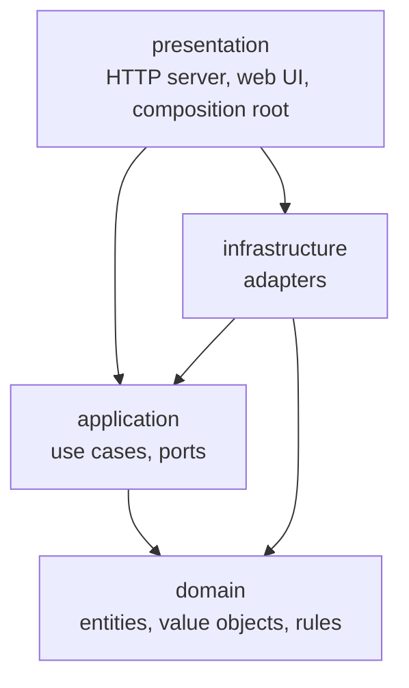
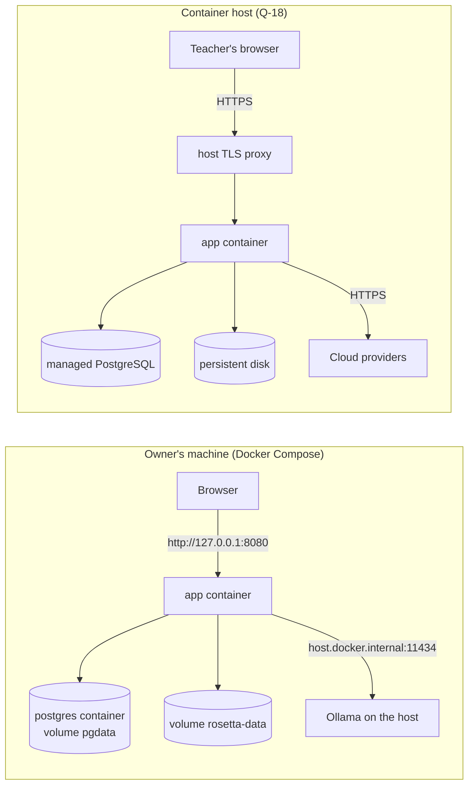

# Architecture (living document)

| | |
|---|---|
| **Status** | Living |
| **Date** | 2026-10-11 (hosted web application, DEC-59..DEC-69) |
| **Owner** | BlackLigth (blacklight0101) |
| **Related** | [RFC-001](rfc/RFC-001-rosetta.md) - [Requirements](spec/requirements.md) - [ADRs](adr/README.md) - [Conventions](conventions.md) - [Data model](data-model.md) - [Environments](environments-and-delivery.md) |

How Rosetta's pieces fit. This document is the canonical home of the **solution layout** (section 4), the **state
lists** (section 5) and the **port names** (section 7). It is updated in the same pull request that changes the
structure. Decisions and their trade-offs are in the ADRs; rules for writing code are in
[conventions.md](conventions.md).

## 1. Context

```mermaid
flowchart LR
  USR[User<br/>developer, tech lead, teacher]
  ADM[Administrator]
  subgraph Host["Container runtime: owner's machine (Compose) or hosted"]
    RST[Rosetta app container<br/>Fastify server + web UI]
    DB[(PostgreSQL)]
    DATA[(Data folder<br/>snapshots, workspaces, logs)]
  end
  OLL[Ollama<br/>on the owner's machine]
  GH[GitHub<br/>public repositories]
  CLOUD[Cloud providers<br/>OpenAI, Anthropic,<br/>OpenAI-compatible]
  PAGES[GitHub Pages<br/>sample report]
  USR -- HTTPS: landing, sign-in, runs, answers, SSE --> RST
  ADM -- HTTPS: accounts, caps, keys --> RST
  RST -- SQL --> DB
  RST -- reads snapshots, writes runs --> DATA
  RST -- resolve ref, download snapshot --> GH
  RST -. local deployment only, host.docker.internal .-> OLL
  RST -- HTTPS, masked excerpts --> CLOUD
  DATA -. sample run published by the owner .-> PAGES
```

Rosetta is a web application with accounts (DEC-59, DEC-62). Visitors see the landing page; users sign in and work
in a private workspace; the administrator manages accounts, server keys and caps. It reads legacy code only as
commit-pinned snapshots of public GitHub repositories, talks to model providers over their APIs, and shows its work
live (ADR-012). Relational data is in PostgreSQL; snapshots and run output are files in the data folder (ADR-016).
The same image runs locally and hosted (ADR-014).

## 2. Containers and components

Two runtime containers (ADR-014): the **app** (one Node.js 24 process, the Fastify server, started by the container
runtime and long-lived) and **PostgreSQL**. Runs execute inside the app process as background jobs, limited by the
run queue (RF-1108). Inside the app:

| Component | Layer | Responsibility |
|---|---|---|
| HTTP server | presentation | Fastify with cookie, CSRF, rate-limit, helmet and static plugins (ADR-017); routes for pages, the JSON API and server-sent events; maps errors to HTTP statuses (RF-007) |
| Authentication and sessions | presentation + infrastructure | sign-in, lockout, session cookie, CSRF and Origin checks, role checks (ADR-015; RF-1009, RF-1100..RF-1103) |
| Web UI | presentation (front end) | landing page, sign-in, projects, start a run, live run, history, report, settings and keys, administration (Preact + Vite, DEC-52) |
| Composition root | presentation | create every adapter and inject it into the use cases; builds a provider set per run from the user's keys or the server keys; the only place that knows concrete classes |
| Use cases | application | projects, `scan`, `understand`, `verify`, `answer`, `report`, `plan`, `estimate`, `export`, `providers test`, accounts, keys, caps, audit |
| Run queue | application | starts queued runs when a slot frees; one running run per user (RF-1108) |
| Agent loop and orchestrator | application | plan agent tasks per area, run the tool-calling loop, collect cards |
| Verifier | application | step 1 citation check, step 2 model judgement (ADR-005) |
| Domain model | domain | code map, areas, cards, claims, citations, statuses, budgets, prices, runs |
| Provider adapters | infrastructure | Ollama, OpenAI, OpenAI-compatible, Anthropic, fake (tests) |
| Guards | infrastructure | egress guard (ADR-006), budget guard (ADR-007) as decorators of the provider port |
| GitHub source | infrastructure | parse URLs, resolve refs to SHAs, download and extract snapshots safely, build permalinks |
| File system adapters | infrastructure | snapshot reader (read-only, ignore rules), output writer (only inside the user's workspace) |
| Database adapters | infrastructure | PostgreSQL repositories with parameterised SQL, migration runner (ADR-016) |
| Security adapters | infrastructure | scrypt password hasher, AES-256-GCM secret box, session token generator (ADR-015) |
| Event sinks | infrastructure | server-sent events broadcaster (per user), `events.jsonl` log |
| Scanner and language packs | infrastructure | universal layer, tree-sitter packs (ADR-004) |
| Writers | infrastructure | Markdown cards, JSON index, specification, HTML report, hand-off package, zip |

## 3. Layers and the dependency rule

Clean Architecture ([ADR-009](adr/ADR-009-clean-architecture.md)):



- `domain` imports nothing outside `domain` and no third-party package; boundary schemas (zod) live in
  `application` (model output, tool arguments) and `infrastructure` (files, configuration).
- `application` imports `domain` and its own ports; it never imports `infrastructure` or `presentation`.
- `infrastructure` implements `application` ports; provider SDKs, tree-sitter, `yazl`, `pg`, `node:crypto` and
  `node:fs` appear only here.
- Fastify and its plugins appear only in `presentation/web/`.
- `presentation` wires everything in one composition root; no business logic.
- No cycles anywhere. Enforced by dependency-cruiser in `npm run verify` (RNF-013, ADR-011).

## 4. Repository and solution layout

Canonical layout; card Delivers paths must match it. Created by the first P1 scaffolding card.

```text
src/
  domain/
    accounts/           User, Role, Session, ProviderKeyRef, UsageCap
    code-map/           CodeMap, FileEntry, Area, Artefact, MapLevel
    cards/              Card, CardType, Claim, Citation, ClaimStatus, Verdict, card ids
    budget/             Money, TokenUsage, Price, PriceTable, Budget, Cap
    runs/               Run, RunManifest, RunEndState, AgentTaskState, RunEvent types
    sources/            GitHubRepoRef, CommitSha, Permalink
    errors/             domain error codes and Result type
  application/
    ports/              port interfaces (section 7)
    use-cases/          one file per use case (section 6)
    agent/              agent loop, tool definitions, orchestrator, card parsing and repair
    verifier/           citation check, judgement step
    estimate/           cost estimator
  infrastructure/
    providers/          ollama/, openai/, openai-compatible/, anthropic/, fake/
    guards/             egress-guard, secret-masker, budget-guard
    github/             url parser, ref resolver, snapshot downloader and extractor
    files/              snapshot-reader, ignore-rules, output-writer, workspace paths
    events/             sse-broadcaster, jsonl-event-log
    db/                 pool, repositories (users, sessions, keys, projects, runs, cost ledger, audit), migration runner
    security/           password-hasher (scrypt), secret-box (AES-256-GCM), token generator
    scan/               universal/, packs/csharp/
    writers/            markdown/, json/, html-report/, handoff/, zip/
    config/             environment schema (RF-1305), project settings schema
    system/             clock, id generator, logger
  presentation/
    web/                Fastify server, plugins, auth hooks, API routes, server-sent events, error-to-status mapping
    main.ts             start-up: read environment, run migrations, create the bootstrap admin, listen
    composition-root.ts
web/                    front-end source of the landing page, web UI and report components (Preact + Vite, DEC-52)
db/migrations/          numbered SQL migrations (ADR-016, data-model.md section 7)
Dockerfile              multi-stage image (RF-1300)
compose.yaml            local deployment: app + PostgreSQL (RF-1301)
.env.example            every environment variable with a safe example (RF-1305)
prompts/                versioned prompts per role (reader/, verifier/, planner/, summariser/)
tests/
  unit/                 mirrors src/
  integration/          mirrors src/
  e2e/                  browser journeys with Playwright against the Compose stack or a test server
  contracts/            contract suites per port
  recordings/           recorded provider responses (ADR-008)
  fixtures/             small legacy samples per stack
eval/                   golden set and the evaluation runner (RNF-006)
site/                   published sample report (RF-800)
```

## 5. Domain model

| Concept | Kind | Invariants |
|---|---|---|
| `CodeMap` | aggregate | file paths unique and relative with forward slashes; every file in exactly one area; byte-identical output for the same input (RF-106) |
| `Area` | entity in `CodeMap` | non-empty; total tokens at most the configured area budget (RF-104) |
| `Card` | aggregate | id unique in the run (`FEAT-001` style, RF-203); at least one claim; `OQ` cards carry a question |
| `Claim` | entity in `Card` | at least one citation; status changes only through the transitions below; never removed (RF-302) |
| `Citation` | value object | `path:startLine-endLine`, `1 <= startLine <= endLine` |
| `Budget` | aggregate per run | spent never exceeds the cap: a call is refused when its worst case would cross it (RF-422) |
| `PriceTable` | value object | prices per million tokens for input, output and cached input, one currency, a date |
| `Run` | aggregate | one stage; manifest written at start and at end; an end state always recorded (RF-003, RNF-002); belongs to exactly one user's project |
| `User` | aggregate | user name unique (case-insensitive); role `admin` or `user`; disabled users have no session (RF-1102) |
| `Session` | entity | expires at 8 hours idle or 7 days; stored only as a hash (RF-1101) |
| `UsageCap` | value object | run, user-day and server-month limits in micro-USD; a call is refused when its worst case would cross any of them (RF-1106) |

**State lists** (canonical):

| State list | Values | Transitions |
|---|---|---|
| `ClaimStatus` | `Proposed`, `CitationInvalid`, `Supported`, `Rejected`, `Unverified` | `Proposed` -> `CitationInvalid` (step 1) / `Supported` / `Rejected` (step 2) / `Unverified` (stopped); `Unverified` -> `Supported` / `Rejected` (resumed). Final: `CitationInvalid`, `Supported`, `Rejected`. Matches RFC-001 section 4.4. |
| `CardType` | `FEAT`, `BR`, `ENT`, `INT`, `OQ` | - |
| `OpenQuestionState` | `Open`, `Answered` | `Open` -> `Answered` when an answer is recorded and the area re-run (RF-241) |
| `AgentTaskState` | `Planned`, `Running`, `Done`, `TurnLimitReached`, `InvalidOutput`, `Failed`, `StoppedByCap` | `Planned` -> `Running` -> one of the other five |
| `RunEndState` | `Completed`, `CapReached`, `Failed`, `Interrupted` | set once when the run ends |
| `RunQueueState` | `Queued`, `Running`, `Ended` | `Queued` -> `Running` when a slot frees; `Running` -> `Ended` with a `RunEndState`; `Queued` -> `Ended` (`Interrupted`) when cancelled (RF-1108) |
| `Role` | `admin`, `user` | changed only by an administrator (RF-1102) |
| `AccountState` | `Active`, `MustChangePassword`, `Locked`, `Disabled` | `MustChangePassword` -> `Active` on change; `Active` -> `Locked` after 5 failures, back after 15 minutes; any -> `Disabled` by an administrator (RF-1100, RF-1102) |
| `MapLevel` | `coarse`, `symbols` | per file, from the scan (RF-110) |
| `Confidence` | `High`, `Medium`, `Low` | set by the agent, never by the verifier |

## 6. Application services (use cases)

Since DEC-59 every use case is reached through the HTTP API of the web UI; there is no command line.

| Use case | Web action (HTTP API) | Requirements |
|---|---|---|
| `CreateProject` | New project form (`POST /api/projects`) | RF-010 |
| `RunScan` | Scan (`POST /api/projects/:id/runs` with stage `scan`) | RF-100..RF-112 |
| `EstimateRun` | estimate on the start page (`GET /api/projects/:id/estimate`) | RF-425 |
| `RunUnderstand` | Start understand, with area, resume and answers options | RF-200..RF-250, RF-006 |
| `RunVerify` | part of `understand`; Resume verification on a run | RF-300..RF-304 |
| `RecordAnswers` | answers page (`PUT /api/runs/:id/answers`) | RF-240, RF-241, RF-1007 |
| `BuildReport` | Build report on a run | RF-500..RF-505 |
| `BuildPlan` | Build hand-off on a run, with the target stack | RF-600..RF-603 |
| `ExportZip` | Download zip / Download hand-off | RF-008 |
| `TestProviders` | Test button in settings | RF-407 |
| `DeleteRun`, `DeleteProject`, `DeleteSnapshot` | Delete buttons (snapshots: administrator) | RF-1012 |
| `SignIn`, `SignOut`, `ChangePassword` | sign-in page, menu, settings | RF-1100, RF-1101, RF-1103 |
| `SaveProviderKey`, `DeleteProviderKey` | settings, keys | RF-1104 |
| `CreateUser`, `UpdateUser`, `ResetPassword`, `SetCaps` | administration page | RF-1102, RF-1106, RF-1107 |
| `ListAudit` | administration, audit view | RF-1109 |
| `ApplyMigrations`, `BootstrapAdmin` | server start-up | RF-1302, RF-1102 |

Every use case receives the signed-in `Actor` (user id and role) and scopes every read and write by it; only
administrator use cases accept another user's id, and they write an audit event (RF-1105).

Each use case is a class with one public `execute` method that takes a typed request and returns a typed `Result`.
Use cases never print; they publish run events through the `RunEventSink` port.

## 7. Ports and adapters

| Port | Purpose | Adapters |
|---|---|---|
| `LlmProvider` | chat with tools; returns text, tool calls, usage (ADR-003) | `OllamaProvider`, `OpenAiProvider`, `OpenAiCompatibleProvider`, `AnthropicProvider`, `FakeProvider` (recordings) |
| `SourceFetcher` | resolve a GitHub URL and ref to a commit and provide its snapshot (ADR-012) | `GitHubSnapshotFetcher`, `FakeSourceFetcher` |
| `RepositoryReader` | list files, read line ranges, grep in a snapshot; read-only, ignore rules applied | `NodeRepositoryReader` |
| `OutputWriter` | write and read files inside the user's workspace only | `NodeOutputWriter` |
| `LanguagePack` | symbols, references, routes for some extensions (ADR-004) | `CSharpPack` (tree-sitter) |
| `ConfigSource` | load and validate the server environment (RF-1305) and project settings | `EnvConfigSource`, `DbProjectSettings` |
| `Clock` | current time | `SystemClock`, `FixedClock` (tests) |
| `IdGenerator` | run ids | `TimestampIdGenerator`, `SequenceIdGenerator` (tests) |
| `Logger` | structured application log with levels and correlation ids (RF-009) | `StdoutJsonLogger`, `JsonlFileLogger`, `FanOutLogger`, `MemoryLogger` (tests) |
| `ProviderCallRecorder` | one record per provider call attempt (RF-408), written by an `ObservedProvider` decorator around every provider | `JsonlProviderCallLog`, `MemoryProviderCallLog` |
| `RunEventSink` | typed run events for the web UI and the replay log (RF-424, RF-1006) | `SseBroadcaster`, `JsonlEventLog`, `FanOutSink`, `MemorySink` |
| `ArchiveWriter` | zip a folder (RF-008) | `YazlArchiveWriter` |
| `UserPrompt` | withdrawn 2026-10-11 (DEC-59): confirmations are fields of the start request (consent, estimate accepted) | - |
| `UserRepository` | accounts, roles, state, lockout counters (RF-1100..RF-1103) | `PgUserRepository`, `MemoryUserRepository` |
| `SessionStore` | create, touch, end and expire sessions by hash (RF-1101) | `PgSessionStore`, `MemorySessionStore` |
| `PasswordHasher` | hash and verify passwords (ADR-015) | `ScryptPasswordHasher` |
| `SecretBox` | encrypt and decrypt provider keys with a key version (RF-1104) | `AesGcmSecretBox` |
| `ProviderKeyRepository` | encrypted keys per user and provider | `PgProviderKeyRepository`, `MemoryProviderKeyRepository` |
| `ProjectRepository` | projects and their settings per user (RF-010) | `PgProjectRepository`, `MemoryProjectRepository` |
| `RunIndex` | run rows: owner, stage, state, queue position, folder, totals (RF-1108) | `PgRunIndex`, `MemoryRunIndex` |
| `CostLedger` | insert one row per call; sums per run, project, user-day, server-month (RF-428, RF-1106) | `PgCostLedger`, `MemoryCostLedger` |
| `AuditLog` | security audit rows (RF-1109) | `PgAuditLog`, `MemoryAuditLog` |
| `Migrator` | apply and check migrations (RF-1302) | `PgMigrator` |

The egress guard and the budget guard are **decorators** of `LlmProvider`: the composition root wraps every real
provider as `BudgetGuard(EgressGuard(provider))`, so no call can bypass them (ADR-006, ADR-007). The budget guard
checks the run cap and, for server keys, the user-day and server-month caps in the same database transaction that
reserves the call's worst case (RF-1106). Every port has a
contract test suite in `tests/contracts/` that its real adapters and its fakes all pass (ADR-008).

## 8. The agent loop

```mermaid
sequenceDiagram
  participant O as Orchestrator
  participant L as Agent loop
  participant P as LlmProvider (guarded)
  participant T as Tools (read-only)
  O->>L: area, files, card schema, prompt version, max turns
  loop turn < maxTurns
    L->>P: system + messages + tool definitions
    P-->>L: text and/or tool calls + usage
    alt tool calls
      L->>T: validated arguments (zod)
      T-->>L: result or error result
    else final answer
      L->>L: parse cards (zod); one repair attempt on failure
    end
  end
  L-->>O: cards, transcript, state, usage
```

- **Tools** (RF-201): `list_area_files`, `read_file(path, startLine, endLine)`, `grep(pattern, pathGlob)`,
  `codemap_query(symbol | path)`. Arguments are validated; invalid calls return an error result the model can correct.
- **Tool protocol**: native tool calling when the model supports it; a JSON-in-text protocol otherwise (RF-205),
  selected per model in configuration.
- **Concurrency**: the orchestrator runs agent tasks with a configurable parallelism (default 1 for Ollama on 8 GB,
  higher for cloud providers); every task shares one `AbortSignal` for Ctrl+C and caps.
- **Prompt caching**: the system prompt, tool definitions and card schema form a stable prefix so providers that
  cache (Anthropic, OpenAI) charge less for repeated turns.
- **Multi-agent pattern** (DEC-57): a **code-driven orchestrator** (no model decides the routing) fans out one
  `reader` agent per area in parallel, the `verifier` is the evaluator of every claim, and the `summariser` is the
  reducer that merges cards across areas (RF-250). Agents never hand off to each other and never talk directly; they
  share nothing but the code map and the orchestrator's inputs. Each role has least privilege: readers get the
  read-only tools for their area, the verifier sees only the cited lines, the summariser sees only cards. The cost of
  the pattern (every agent re-reads context, so tokens grow with the number of agents) is bounded by the caps of
  ADR-007. Frameworks that own this loop (LangGraph, Google ADK) are not used (ADR-003, DEC-58).
- **Untrusted content** (ADR-013): tool results enter the conversation only inside delimited repository-content
  blocks, never in the system prompt (RF-145); `grep` runs in a worker with limits (RF-146).
- **Context limit**: each task tracks its prompt size; when a configured share of the model's context is reached, the
  task ends with its cards so far (`TurnLimitReached`) rather than failing.

## 9. Provider integration

| Concern | Rule |
|---|---|
| Calls | synchronous HTTP per turn, streamed when the adapter supports it, with a timeout and an `AbortSignal` |
| Retries | only in adapters: exponential back-off with jitter on rate limits, timeouts and server errors; honour retry-after (RF-406) |
| Failures | permanent errors (bad key, unknown model) stop the task with partial cards saved; the run continues unless every task is affected |
| Usage | every adapter returns input, output and cached tokens; estimated and flagged when the provider reports none (RF-421) |
| Idempotency | not needed: provider calls have no side effects; a retried call may cost twice and is metered twice |

## 10. Security

- Accounts with scrypt-hashed passwords, lockout and rate limits; server-side sessions behind the
  `__Host-rosetta_session` cookie; CSRF token and `Origin` check on every state-changing request; roles checked on
  the server for every route (ADR-015; RF-1009, RF-1100, RF-1101).
- Every query and file path is scoped by the signed-in user; another user's id answers 404; administrator access to
  another workspace is audited (RF-1105, RF-1109).
- Server provider keys come from the environment (the host's secret store); user keys are encrypted with AES-256-GCM
  under `ROSETTA_SECRET_KEY`; no key is ever logged or sent to the browser (RNF-003, RF-1104).
- SQL is parameterised only; the app connects as `rosetta_app`, which cannot change the schema (ADR-016).
- Locally, Compose publishes the app on `127.0.0.1` only; hosted, the host terminates HTTPS and HSTS is sent (RF-1301,
  RF-1013, RF-1304).
- Snapshot extraction rejects archive entries that would land outside the snapshot folder (RF-122).
- The repository reader resolves every path against the snapshot root and refuses anything outside it or matched by
  ignore rules (RF-140); the output writer does the same for the output folder (RF-005).
- Model output is data: it is parsed with schemas, never executed, never used as a shell command or an unchecked path.
- The egress guard masks secrets before any call and logs what was sent (RF-141, RF-142); if masking fails the call
  is blocked (fail closed).
- Downloads use https to GitHub hosts only, with size and entry limits, and refuse link entries (RF-127).
- Repository and model text is rendered as text only; the pages and the report carry a content security policy and
  no referrer (RF-507, RF-1013).
- Refused requests, failed sign-ins, refused reads, skipped links and blocked calls are logged as security events
  (RF-009) and, for account events, in the audit trail (RF-1109).
- The trust boundaries, their threats and the mapping to OWASP Top 10:2025 and the OWASP Top 10 for LLM applications
  are in the [threat model](security/threat-model.md) (ADR-013).

**Secure by default** (RNF-014):

| Default | Value | Changed only by |
|---|---|---|
| Access | sign-in required for everything except landing, sign-in, `/healthz`, assets and `robots.txt` | never |
| Local port | published on `127.0.0.1:8080` by `compose.yaml` | editing `compose.yaml` (documented as unsafe) |
| Self sign-up | none | never in R1 |
| Server-key caps | $0.50 per run, $1.00 per user-day, $10.00 per server-month (RF-1106) | administration page |
| Cloud egress | consent checkbox on the start page before the first call (RF-143) | never skipped |
| Secret masking | on | never |
| Built-in deny list | on (RF-147) | `scan.allowDenied`, recorded in the run |
| Transcripts | masked | the project setting `transcripts: false` to skip them |
| Telemetry | none | never |

## 11. Error handling

| Layer | Rule |
|---|---|
| domain | pure functions; invariant violations return a typed `Result` error; no exceptions for expected cases |
| application | returns `Result`; turns infrastructure exceptions into task states (`Failed`) with the error code |
| infrastructure | throws `Error` subclasses with an `RST-xxxx` code and the original as `cause` |
| presentation | maps errors to HTTP statuses (RF-007) and returns code, message and next step as JSON; pages show them next to the field or in a banner; no stack trace in any response |

Codes and ranges: [conventions.md](conventions.md) section 6.

## 12. Cross-cutting rules

- **Time**: only through `Clock`; timestamps stored in UTC ISO 8601.
- **Determinism**: stable ordering in every written file; ids from `IdGenerator`; the code map hash identifies input.
- **Paths**: relative to the repository root with forward slashes in every stored value; platform paths only inside
  file system adapters (RNF-001).
- **Configuration**: the server environment is read once at start-up and validated (RF-1305); project settings are
  read from the database at the start of each run and passed down as an immutable object.
- **Ownership**: every row with user data carries `user_id`; repositories take the actor and add it to every
  `WHERE` clause; workspace paths are derived from the user id, never from request text.

## 13. Observability

The run folder is the audit trail: `manifest.json`, `egress.log.jsonl`, `cost.json`, agent transcripts and coverage
(RF-003, RF-142, RF-230, RF-426). The application log goes to standard output (collected by the container runtime or
the host) and to the daily file in the data folder, at the level of `ROSETTA_LOG_LEVEL` (RF-009). Account events
are in the audit table (RF-1109). `/healthz` serves the host's health check (RF-1303). No telemetry.

## 14. Data ownership

| Data | Owner (writer) | Readers |
|---|---|---|
| Accounts, sessions, provider keys | account use cases (ADR-015) | sign-in, session hook, provider factory |
| Projects and run index | project and run use cases | web UI lists, run queue |
| Snapshots in `<data>/sources/` | `SourceFetcher`, once per commit; shared, read-only afterwards | scanner, tools, verifier |
| `events.jsonl` per run | `JsonlEventLog` | web UI (late subscribers), report replay |
| `provider-calls.jsonl` per run | `ObservedProvider` decorator (RF-408) | web UI API calls panel (RF-1011), debugging |
| `<data>/logs/rosetta-YYYY-MM-DD.jsonl` and standard output | `JsonlFileLogger`, `StdoutJsonLogger` (RF-009) | the administrator, web UI logs panel (own runs) |
| `cost_ledger` table | budget guard, one row per call (RF-428) | web UI header totals (RF-1010), cost page, caps (RF-1106), report dashboard |
| `audit_events` table | account and key use cases, auth hooks (RF-1109) | administration audit view |
| `codemap.json` | `RunScan` | every later stage |
| Run folders | the use case of that run | report, plan, export |
| `answers.md` | the user through the answers page (skeleton generated by `RunUnderstand`) | `RunUnderstand` with answers, `BuildPlan` |
| `handoff/` | `BuildPlan` | the modernisation team |

File formats: [data-model.md](data-model.md).

## 15. Deployment view



One image, two places (ADR-014): locally `compose.yaml` runs the app and PostgreSQL with named volumes and publishes
the app on `127.0.0.1:8080`; hosted, the same image runs behind the host's HTTPS with managed PostgreSQL and a
persistent disk. Migrations run at start-up before the server listens (RF-1302). GitHub and cloud providers are
reached over HTTPS. The sample report is static files on GitHub Pages. Details:
[environments-and-delivery.md](environments-and-delivery.md).

## 16. Quality attributes

| Requirement | Mechanism |
|---|---|
| RNF-001 portability | one Linux image; path rules (section 12); CI on Windows and Linux |
| RNF-002 robustness | run manifest at start and end; incremental writes per finished task; shared `AbortSignal` |
| RNF-003 secrets | server keys only from the environment; user keys encrypted (RF-1104); egress guard; output scan test |
| RNF-004 reproducibility | manifest with versions, prompt versions, models, code map hash |
| RNF-005 offline tests | fake provider, contract suites, network blocked in tests |
| RNF-006 measured quality | `eval/` golden set and runner |
| RNF-011 local-first | Ollama adapter via `host.docker.internal`; snapshot cache; only the first fetch needs GitHub |
| RNF-012 estimate accuracy | estimator calibrated from cost reports |
| RNF-013 Clean Architecture | dependency-cruiser rules (section 3) |
| RNF-014 secure by default | defaults table (section 10); `.env.example` test |
| RNF-016 availability | host health check on `/healthz`, restart policy, server cap |

## 17. Testing approach (summary)

| Level | May cross | Examples |
|---|---|---|
| Unit (about 60%) | nothing: no disk, network, clock or randomness | citation parsing, claim transitions, pricing, budget checks, area grouping |
| Integration (about 30%) | one real boundary: the file system in a temporary folder, a disposable PostgreSQL (ADR-016), the HTTP server in process, or recordings through the fake provider | scan of a fixture repository, agent loop with recordings, writers, repositories, auth and access-matrix tests |
| End-to-end (about 10%) | a browser (Playwright) against the server with the fake provider and a fixture repository | sign in -> create project -> `scan` -> `understand` -> `report`; administrator creates a user |
| Contract | each port's suite against every adapter and fake | `LlmProvider`, `RepositoryReader`, `OutputWriter`, `UserRepository`, `CostLedger` |

Test names start with the requirement id; failing tests are committed first (ADR-010). Rules:
[conventions.md](conventions.md) section 7.

## 18. Open architecture questions

| Question | Link | Default |
|---|---|---|
| Which local model runs the reader role? | Q-04 | chosen by the P1 spike card |
| Target stack input for `plan` | Q-06 | the user types the target on the hand-off form; otherwise two options proposed |
| HTTP server framework | Q-17 | Fastify (ADR-017) |
| Hosting provider | Q-18 | chosen when the hosted deploy card starts |
| Report rendering approach | ADR index, deferred decisions | decided in the first P3 report card |
| Move to TypeScript 7 | ADR index, deferred decisions | when typescript-eslint supports it |
