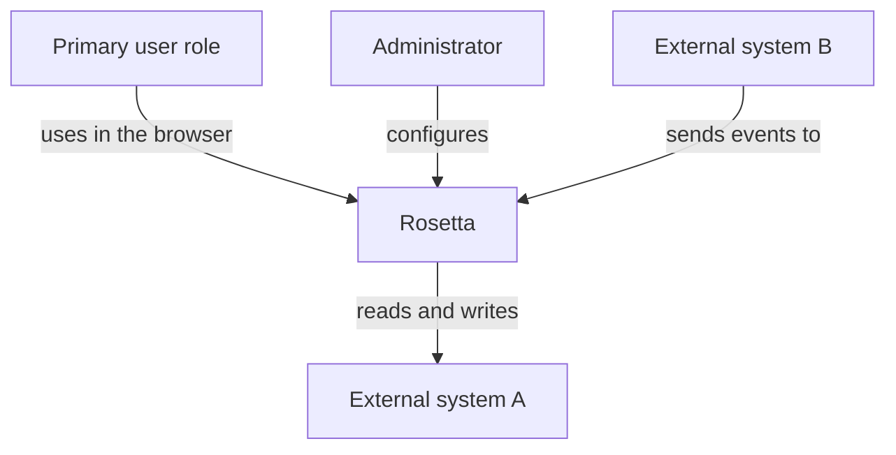
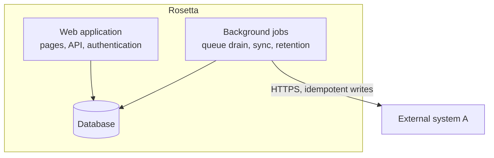
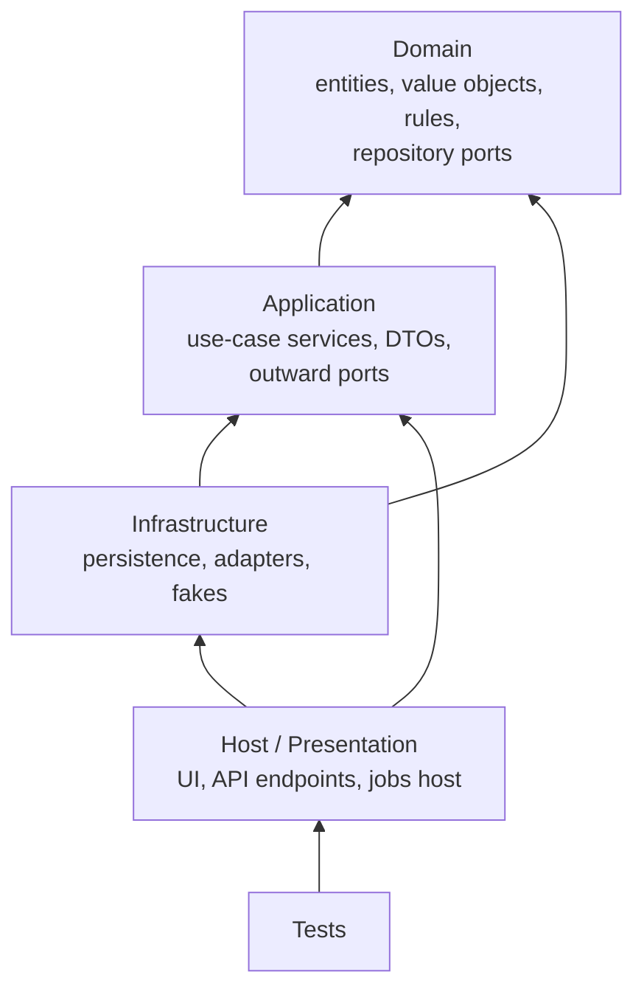
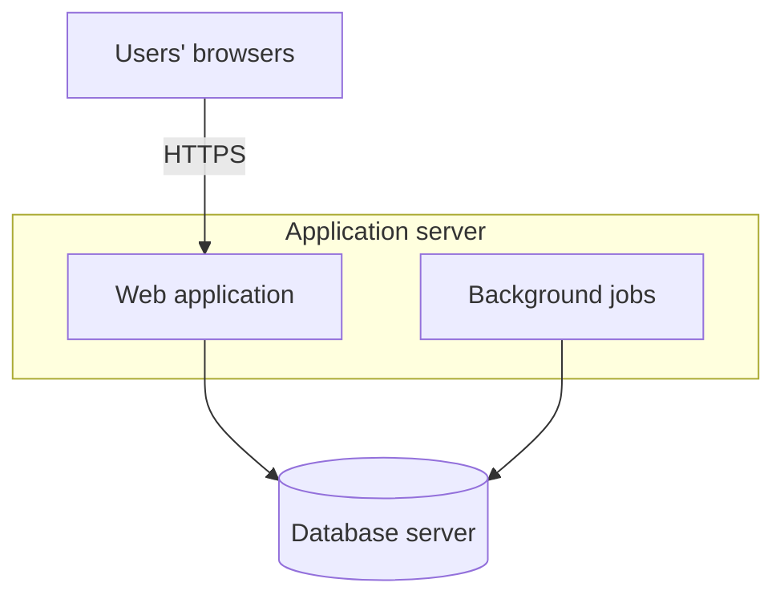

# Architecture (living document)

| | |
|---|---|
| **Status** | Living document, last revised 2026-10-09. Updated in the same change as any structural decision |
| **Decisions** | <!-- FILL: list the ADRs this document applies, one short phrase each, e.g. "ADR-002 (layering), ADR-003 (identity)". Keep the list in step with docs/adr/README.md. --> |
| **Sources** | [RFC-001](rfc/RFC-001-rosetta.md), [requirements](spec/requirements.md), [ADR index](adr/README.md), [data model](data-model.md), [conventions](conventions.md) |
| **Owner of changes** | any change to structure, a port, a container or a background job edits this document in the same branch; the verifier rejects one without the other |

This document says how the pieces of Rosetta fit together, so that the first build phase can scaffold them
without re-deciding. The reasons behind each choice live in the RFC and the ADRs; this page states the result and
links to them. Requirements are cited by id (RF-nnn, RNF-nnn), decisions by ADR-nnn or DEC-nn, open points by Q-nn.

<!-- FILL: Write this document after the RFC and the first ADRs exist. Every section below is a skeleton: replace
each FILL comment with the project's facts, delete sections that do not apply (say "Not applicable: <reason>"
instead of leaving them empty), and never invent an answer. Anything not yet decided becomes a Q-nn in
docs/spec/requirements.md with a default, and is listed in section 18. Stack-specific rules come from the chosen
preset (for example references/presets/dotnet-house.md) and belong here only as their structural consequence. -->

## 1. Context

<!-- FILL: Who uses the system and which external systems, devices and data sources it talks to. One box per
person role and per external system; the system itself is one box. Name the direction of every arrow (who calls
whom). This is the picture a stakeholder should understand in one minute. -->



| Actor or system | Kind | Interaction | Direction | Spec |
|---|---|---|---|---|
| <!-- FILL: example row, replace --> Primary user role | person | signs in and records work | inbound | RF-001 |
| <!-- FILL: example row, replace --> External system A | external system | master data read, results written back | outbound | RF-001 |

## 2. Containers and components

<!-- FILL: The deployable and runnable units (web app, worker, gateway, database, message broker, mobile app,
CLI tool) and the main components inside the central one. Keep it C4-level 2: what runs where and what talks to
what, with the protocol on each arrow. A container that exists only because a dependency needs a special runtime
(for example a vendor SDK that needs another platform) is named here with its ADR. -->



| Container | Technology | Responsibility | Talks to | ADR |
|---|---|---|---|---|
| <!-- FILL: example row, replace --> Web application | <!-- FILL: stack --> | pages, inbound API, authentication | Database | ADR-nnn |

## 3. Layers and the dependency rule

<!-- FILL: The code layering and the one rule that keeps it honest. The default below is Clean Architecture,
strictly inward; replace the layer names and contents with the stack's equivalent (for example feature folders
in a game, or modules in a mobile app) but keep an explicit dependency direction and say how it is enforced
(project references, module boundaries, lint rule, architecture test). -->



Rules: Domain references nothing. Application references Domain only (no database driver, HTTP client or vendor
SDK types). Infrastructure implements the ports of Application and Domain. The host composes everything and is
the only place that knows concrete types. <!-- FILL: state how the rule is enforced and checked by the verifier. -->

## 4. Repository and solution layout

<!-- FILL: The folder and project skeleton the first scaffolding card creates, with one line per top-level
folder. Folder names written here are binding: docs/conventions.md refers to them and the verifier compares the
scaffold with this block. -->

```
<solution or workspace file>
  src/<Project>.Domain/            <!-- FILL: folders -->
  src/<Project>.Application/       <!-- FILL: folders -->
  src/<Project>.Infrastructure/    <!-- FILL: folders -->
  src/<Project>.Web/               <!-- FILL: folders -->
  tests/<Project>.Tests/           unit and integration tests
  tests/<Project>.E2E/             end-to-end journeys
  db/migrations/                   numbered migrations (docs/data-model.md section 7)
  docs/                            this documentation
```

## 5. Domain model

<!-- FILL: One row per aggregate, entity and value object that carries a business rule. The invariants column is
the checklist the builder turns into unit tests, so write each rule so that a test can prove it. State machines
get their own ADR and a diagram in docs/process-flows.md. -->

| Element | Kind | Invariants |
|---|---|---|
| <!-- FILL: example row, replace --> `Request` | aggregate root | state changes only through its methods; a closed request is never reopened; the reference number never changes once assigned |
| <!-- FILL: example row, replace --> `ReferenceNumber` | value object | fixed format, validated on creation |

State lists (canonical; other documents link here and never restate them differently):

| Entity | States | Transitions |
|---|---|---|
| <!-- FILL: example row, replace --> `Request` | `Draft`, `Submitted`, `Approved`, `Rejected`, `Closed` | ADR-nnn; diagram in [process flows](process-flows.md) |

## 6. Application services

<!-- FILL: The page-facing and job-facing services, one line each with the module that owns it. Say how a
service runs a use case (open a unit of work, call the domain, persist, map to DTOs, commit) and the rule for
side effects on external systems: they happen after the state change that authorises them is committed, with the
audit row in the same transaction. -->

## 7. Ports and adapters

<!-- FILL: Every outward dependency (database, clock, identity directory, external system, device, file store,
e-mail) is a port in Application with at least one real adapter and one fake. Describe methods by intent, not by
signature. A fake must pass the same contract test as the real adapter. -->

| Port | Methods (intent, not signatures) | Implementations |
|---|---|---|
| <!-- FILL: example row, replace --> `IClock` | now in UTC; today in the business time zone | system clock; fixed clock in tests |
| <!-- FILL: example row, replace --> `IExternalSystemAClient` | read master data; submit result (idempotency key); outcome by key; health | HTTP adapter; fake with recorded responses |

## 8. Integration patterns

<!-- FILL: One row per integration. For each one decide, and record here, the style, what the user experiences
when the other side is down, how a repeated call is made harmless, and the timeout and retry policy. An
integration that writes to a system that can be down or slow must not block the user: it goes through a durable
queue or outbox (8.2). An integration whose outcome can be unknown needs an idempotency key and reconciliation
(8.3). -->

| Integration | Direction | Style | When the other side is down | Idempotency | Timeout and retry | Spec / ADR |
|---|---|---|---|---|---|---|
| <!-- FILL: example row, replace --> External system A: submit result | outbound | async through the outbox | work continues; items wait in the queue; the queue age is visible | key persisted before the call | 10 s timeout; backoff 15 s to 5 min | RF-001, ADR-nnn |

### 8.1 Synchronous calls

<!-- FILL: Which calls are made while a user waits, their time budget (RNF id), and what the page shows on a
timeout. An empty, late or unparsable reply is a failure, never a silent success. -->

### 8.2 Store-and-forward (outbox or durable queue)

<!-- FILL: When a dependency can be down, the user's action commits locally together with an outbox row in the
same transaction; a single-instance background job drains the outbox in order. Define: the outbox table
(docs/data-model.md), ordering guarantees, backoff, the maximum age before an alert, and who can see and act on
stuck items. Delete this subsection only if no write leaves the system. -->

### 8.3 Idempotency and unknown outcomes

<!-- FILL: Every write to another system carries an idempotency key that is persisted before the call. Outcomes
are classified as Success, BusinessError (the other side refused; a person corrects), Transient (the call never
reached the other side; resend with the same key) and Unknown (the call may have happened; resolve by asking the
other side by key, never by resending blindly). Name the reconciliation job and the screen where a person resolves
what the job cannot. Never offer "press again". -->

### 8.4 Inbound interfaces

<!-- FILL: For each inbound API, file drop or message consumer: how a caller is registered and authenticated, the
idempotency key on writes and where repeated keys are answered from, schema validation, the error format (for
example RFC 7807 problem details), and the log row written per call. Delete if the system has no inbound
interface. -->

## 9. Background jobs

<!-- FILL: Every scheduled or queue-driven job. Jobs are plain classes behind a thin host wrapper so the host can
change. Say which ones must run as a single instance and how (lease row, lock), and which service account each
uses (docs/data-model.md section 6). -->

| Job | Trigger | Single instance | Reads / writes | Runs as |
|---|---|---|---|---|
| <!-- FILL: example row, replace --> Outbox drain | signal + poll every 15 s | yes, lease | outbox rows to External system A | writer account |

## 10. Security and identity

<!-- FILL: Authentication (who can sign in and how), authorization (policies named by permission code, never by
role name; roles are data), where user identities come from, service accounts and least privilege, secrets (never
in the repository; see docs/environments-and-delivery.md section 4), data protection (personal data, hashing,
encryption at rest or in transit), audit trail, and the anonymous surface (ideally a liveness endpoint only). -->

| Concern | Decision | ADR / RNF |
|---|---|---|
| <!-- FILL: example row, replace --> Authentication | company single sign-on; no local passwords | ADR-nnn, RNF-001 |
| <!-- FILL: example row, replace --> Authorization | one permission code per page, endpoint and service action | ADR-nnn, RNF-nnn |

## 11. Error handling

<!-- FILL: The rule per layer. Codes, message keys and the user-facing behaviour when something is down are in
docs/conventions.md section 7; this section states only the structural rule. -->

| Layer | Rule |
|---|---|
| Domain | throws domain exceptions for broken rules; never catches |
| Application | turns domain and port failures into a result (ok, business error with a message key, technical error with a correlation id); logs technical errors once; never swallows |
| Infrastructure | maps driver and transport errors to named failures (unique violation, timeout, unreachable); retries only where the adapter's declared policy says so |
| Presentation | business error shown with its code and text; technical error shown with the correlation id and a retry; never a stack trace |
| Background jobs | catch per iteration, log, continue; failures visible on the health page |

## 12. Cross-cutting rules

<!-- FILL: Time (one clock abstraction; store UTC with a Utc suffix; display in the business time zone; no direct
calls to the system clock in business logic), localisation (languages as data, fallback chain, business formats
that never follow the UI culture), configuration (what is data in the database versus a configuration key), and
any other rule every module must follow. Delete what does not apply. -->

## 13. Observability

<!-- FILL: Structured logs with the fields of docs/conventions.md section 8; one correlation id per user action or
job item that flows through services, adapters, external calls and audit rows; health endpoints (liveness and
readiness, what each checks); metrics if any; where logs go and for how long; alerting is in
docs/environments-and-delivery.md section 13. No credential or secret-bearing payload in any entry. -->

## 14. Data ownership

<!-- FILL: Which module owns which schema or data set, who may write it, and the rule that no module writes
another module's tables. Name the service accounts and point to docs/data-model.md for tables, grants and
migrations. State explicitly any data the system must NOT connect to. -->

## 15. Deployment view

<!-- FILL: Where each container runs in production, how many instances, what sits in front of it, and the
network paths between them. Then the configuration surface (every setting that lives outside the database and
differs per environment or site) and the start-up guards (for example: the applied migration set must match the
build, or be inside the rollback window of docs/data-model.md section 7). Environments and the release procedure
are in docs/environments-and-delivery.md. -->



| Setting | Meaning |
|---|---|
| <!-- FILL: example row, replace --> `ConnectionStrings:Writer` | connection for the writer service account; value set per environment, never committed |

Start-up guards: <!-- FILL: list them, or "none". -->

Upgrades and rollback: <!-- FILL: the compatibility rule between application and schema versions (for example
N-1: migrations stay compatible with the previous build so a rollback keeps working). -->

## 16. Quality attributes

<!-- FILL: One row per RNF that shapes the architecture. The mechanism column names the part of this document that
delivers it; the verification column names the test or check that proves it. An RNF without a mechanism or a
check is a hole to raise in review. -->

| Attribute | Target or scenario | Mechanism | RNF | How verified |
|---|---|---|---|---|
| <!-- FILL: example row, replace --> Availability | users keep working while External system A is down for an hour | outbox (8.2) | RNF-001 | chaos test: stop the fake for an hour, zero lost or duplicated writes |
| <!-- FILL: example row, replace --> Performance | main list page under 2 s | server paging, indexed queries | RNF-nnn | integration test with seeded volume |

## 17. Testing approach (summary)

<!-- FILL: The test levels, the boundary each one may cross, and the target ratio decided in its ADR (for example
60 / 30 / 10 unit / integration / end-to-end by count). Name the projects or folders. The full rules are in
CLAUDE.md and the verifier's checklist. -->

| Level | Boundary | Examples | Location |
|---|---|---|---|
| Unit | none (no I/O, database, network, process) | value objects, aggregate transitions, services with fakes | <!-- FILL --> |
| Integration | exactly one real boundary | repositories on a real database, HTTP endpoints, one adapter against a local listener | <!-- FILL --> |
| End-to-end | the running app in a real client | main user journeys with fakes for external systems | <!-- FILL --> |

## 18. Open architecture questions

<!-- FILL: Every undecided structural point, each linked to its Q-nn in docs/spec/requirements.md (with its default
and the phase that needs the answer) or to a Proposed ADR. Nothing is decided here that is not also recorded
there. Remove answered items and cite the DEC-nn or ADR that closed them in the change that removes them. -->

| Topic | Question | Blocks | Tracked as |
|---|---|---|---|
| <!-- FILL: example row, replace --> Background job host | in-process hosted service or separate worker? | P2 | Q-01 (default: in-process) |
