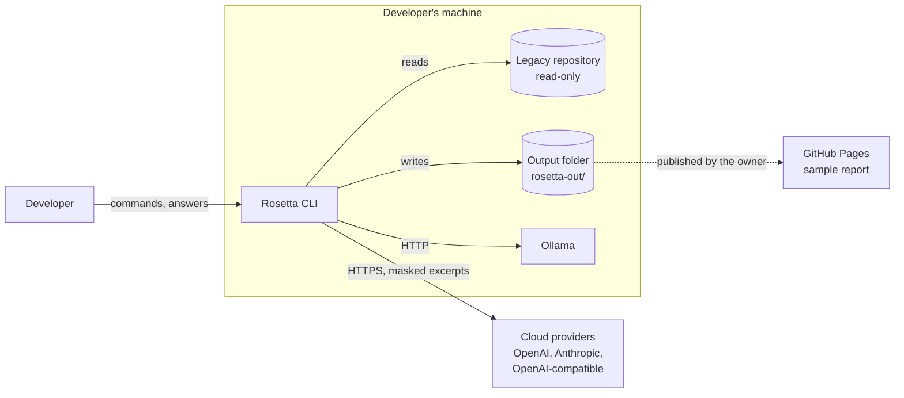
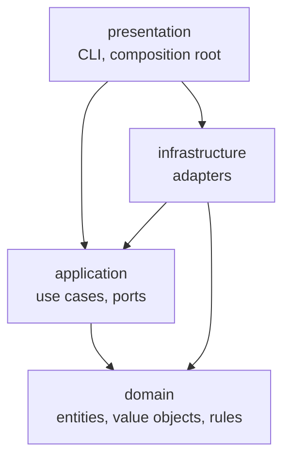

# Architecture (living document)

| | |
|---|---|
| **Status** | Living |
| **Date** | 2026-10-10 |
| **Owner** | BlackLigth (blacklight0101) |
| **Related** | [RFC-001](rfc/RFC-001-rosetta.md) - [Requirements](spec/requirements.md) - [ADRs](adr/README.md) - [Conventions](conventions.md) - [Data model](data-model.md) - [Environments](environments-and-delivery.md) |

How Rosetta's pieces fit. This document is the canonical home of the **solution layout** (section 4), the **state
lists** (section 5) and the **port names** (section 7). It is updated in the same pull request that changes the
structure. Decisions and their trade-offs are in the ADRs; rules for writing code are in
[conventions.md](conventions.md).

## 1. Context



Rosetta has one actor (the developer) and talks to the outside only through model provider APIs (RFC-001 section
4.1). Everything it produces is a file in the output folder.

## 2. Containers and components

There is one container: a Node.js 24 process started per command. It has no server, no database, no background
service (ADR-002). Inside it:

| Component | Layer | Responsibility |
|---|---|---|
| CLI | presentation | parse commands, load and validate configuration, print progress and results, map errors to exit codes |
| Composition root | presentation | create every adapter and inject it into the use cases; the only place that knows concrete classes |
| Use cases | application | `scan`, `understand`, `verify`, `answer`, `report`, `plan`, `estimate`, `export`, `providers test` |
| Agent loop and orchestrator | application | plan agent tasks per area, run the tool-calling loop, collect cards |
| Verifier | application | step 1 citation check, step 2 model judgement (ADR-005) |
| Domain model | domain | code map, areas, cards, claims, citations, statuses, budgets, prices, runs |
| Provider adapters | infrastructure | Ollama, OpenAI, OpenAI-compatible, Anthropic, fake (tests) |
| Guards | infrastructure | egress guard (ADR-006), budget guard (ADR-007) as decorators of the provider port |
| File system adapters | infrastructure | repository reader (read-only, ignore rules), output writer (only inside the output folder) |
| Scanner and language packs | infrastructure | universal layer, tree-sitter packs (ADR-004) |
| Writers | infrastructure | Markdown cards, JSON index, specification, HTML report, hand-off package, zip |

## 3. Layers and the dependency rule

Clean Architecture ([ADR-009](adr/ADR-009-clean-architecture.md)):



- `domain` imports nothing outside `domain` and no third-party package; boundary schemas (zod) live in
  `application` (model output, tool arguments) and `infrastructure` (files, configuration).
- `application` imports `domain` and its own ports; it never imports `infrastructure` or `presentation`.
- `infrastructure` implements `application` ports; provider SDKs, tree-sitter, `yazl` and `node:fs` appear only here.
- `presentation` wires everything in one composition root; no business logic.
- No cycles anywhere. Enforced by dependency-cruiser in `npm run verify` (RNF-013, ADR-011).

## 4. Repository and solution layout

Canonical layout; card Delivers paths must match it. Created by the first P1 scaffolding card.

```text
src/
  domain/
    code-map/           CodeMap, FileEntry, Area, Artefact, MapLevel
    cards/              Card, CardType, Claim, Citation, ClaimStatus, Verdict, card ids
    budget/             Money, TokenUsage, Price, PriceTable, Budget, Cap
    runs/               Run, RunManifest, RunEndState, AgentTaskState
    errors/             domain error codes and Result type
  application/
    ports/              port interfaces (section 7)
    use-cases/          one file per use case (section 6)
    agent/              agent loop, tool definitions, orchestrator, card parsing and repair
    verifier/           citation check, judgement step
    estimate/           cost estimator
  infrastructure/
    providers/          ollama/, openai/, openai-compatible/, anthropic/, fake/
    guards/             egress-guard, secret-masker, budget-guard
    files/              repository-reader, ignore-rules, output-writer
    scan/               universal/, packs/csharp/
    writers/            markdown/, json/, html-report/, handoff/, zip/
    config/             YAML loader and schema
    system/             clock, id generator, logger
  presentation/
    cli/                commands, progress rendering, exit codes
    composition-root.ts
prompts/                versioned prompts per role (reader/, verifier/, planner/, summariser/)
tests/
  unit/                 mirrors src/
  integration/          mirrors src/
  e2e/                  CLI journeys
  contracts/            contract suites per port
  recordings/           recorded provider responses (ADR-008)
  fixtures/             small legacy samples per stack
eval/                   golden set and the evaluation runner (RNF-006)
site/                   published sample report (RF-800)
```

## 5. Domain model

| Concept | Kind | Invariants |
|---|---|---|
| `CodeMap` | aggregate | file paths unique and relative with forward slashes; every file in exactly one area; byte-identical output for the same input (RF-106) |
| `Area` | entity in `CodeMap` | non-empty; total tokens at most the configured area budget (RF-104) |
| `Card` | aggregate | id unique in the run (`FEAT-001` style, RF-203); at least one claim; `OQ` cards carry a question |
| `Claim` | entity in `Card` | at least one citation; status changes only through the transitions below; never removed (RF-302) |
| `Citation` | value object | `path:startLine-endLine`, `1 <= startLine <= endLine` |
| `Budget` | aggregate per run | spent never exceeds the cap: a call is refused when its worst case would cross it (RF-422) |
| `PriceTable` | value object | prices per million tokens for input, output and cached input, one currency, a date |
| `Run` | aggregate | one stage; manifest written at start and at end; an end state always recorded (RF-003, RNF-002) |

**State lists** (canonical):

| State list | Values | Transitions |
|---|---|---|
| `ClaimStatus` | `Proposed`, `CitationInvalid`, `Supported`, `Rejected`, `Unverified` | `Proposed` -> `CitationInvalid` (step 1) / `Supported` / `Rejected` (step 2) / `Unverified` (stopped); `Unverified` -> `Supported` / `Rejected` (resumed). Final: `CitationInvalid`, `Supported`, `Rejected`. Matches RFC-001 section 4.4. |
| `CardType` | `FEAT`, `BR`, `ENT`, `INT`, `OQ` | - |
| `OpenQuestionState` | `Open`, `Answered` | `Open` -> `Answered` when an answer is recorded and the area re-run (RF-241) |
| `AgentTaskState` | `Planned`, `Running`, `Done`, `TurnLimitReached`, `InvalidOutput`, `Failed`, `StoppedByCap` | `Planned` -> `Running` -> one of the other five |
| `RunEndState` | `Completed`, `CapReached`, `Failed`, `Interrupted` | set once when the run ends |
| `MapLevel` | `coarse`, `symbols` | per file, from the scan (RF-110) |
| `Confidence` | `High`, `Medium`, `Low` | set by the agent, never by the verifier |

## 6. Application services (use cases)

| Use case | Command | Requirements |
|---|---|---|
| `InitProject` | `rosetta init <path>` | RF-001 |
| `RunScan` | `rosetta scan` | RF-100..RF-112 |
| `EstimateRun` | `rosetta estimate <stage>` | RF-425 |
| `RunUnderstand` | `rosetta understand [--area] [--resume] [--with-answers]` | RF-200..RF-250, RF-006 |
| `RunVerify` | part of `understand`; `rosetta verify <run-id>` to resume | RF-300..RF-304 |
| `RecordAnswers` | `answers.md`; `rosetta answer` (Could) | RF-240..RF-242 |
| `BuildReport` | `rosetta report <run-id> [--format md]` | RF-500..RF-505 |
| `BuildPlan` | `rosetta plan <run-id> --target "<stack>"` | RF-600..RF-603 |
| `ExportZip` | `rosetta export <run-id> --zip [--handoff]` | RF-008 |
| `TestProviders` | `rosetta providers test` | RF-407 |

Each use case is a class with one public `execute` method that takes a typed request and returns a typed `Result`.
Use cases never print; they report progress through the `ProgressReporter` port.

## 7. Ports and adapters

| Port | Purpose | Adapters |
|---|---|---|
| `LlmProvider` | chat with tools; returns text, tool calls, usage (ADR-003) | `OllamaProvider`, `OpenAiProvider`, `OpenAiCompatibleProvider`, `AnthropicProvider`, `FakeProvider` (recordings) |
| `RepositoryReader` | list files, read line ranges, grep; read-only, ignore rules applied | `NodeRepositoryReader` |
| `OutputWriter` | write and read files inside the output folder only | `NodeOutputWriter` |
| `LanguagePack` | symbols, references, routes for some extensions (ADR-004) | `CSharpPack` (tree-sitter) |
| `ConfigSource` | load and validate the configuration | `YamlConfigSource` |
| `Clock` | current time | `SystemClock`, `FixedClock` (tests) |
| `IdGenerator` | run ids | `TimestampIdGenerator`, `SequenceIdGenerator` (tests) |
| `Logger` | diagnostic logs to standard error | `StderrLogger`, `MemoryLogger` (tests) |
| `ProgressReporter` | progress events for the CLI and the live cost meter (RF-004, RF-424) | `TerminalProgress`, `JsonProgress`, `MemoryProgress` |
| `ArchiveWriter` | zip a folder (RF-008) | `YazlArchiveWriter` |
| `UserPrompt` | yes/no confirmations (cloud warning, estimate threshold) | `TerminalPrompt`, `AutoAnswerPrompt` (`--yes`, tests) |

The egress guard and the budget guard are **decorators** of `LlmProvider`: the composition root wraps every real
provider as `BudgetGuard(EgressGuard(provider))`, so no call can bypass them (ADR-006, ADR-007). Every port has a
contract test suite in `tests/contracts/` that its real adapters and its fakes all pass (ADR-008).

## 8. The agent loop

```mermaid
sequenceDiagram
  participant O as Orchestrator
  participant L as Agent loop
  participant P as LlmProvider (guarded)
  participant T as Tools (read-only)
  O->>L: area, files, card schema, prompt version, max turns
  loop turn < maxTurns
    L->>P: system + messages + tool definitions
    P-->>L: text and/or tool calls + usage
    alt tool calls
      L->>T: validated arguments (zod)
      T-->>L: result or error result
    else final answer
      L->>L: parse cards (zod); one repair attempt on failure
    end
  end
  L-->>O: cards, transcript, state, usage
```

- **Tools** (RF-201): `list_area_files`, `read_file(path, startLine, endLine)`, `grep(pattern, pathGlob)`,
  `codemap_query(symbol | path)`. Arguments are validated; invalid calls return an error result the model can correct.
- **Tool protocol**: native tool calling when the model supports it; a JSON-in-text protocol otherwise (RF-205),
  selected per model in configuration.
- **Concurrency**: the orchestrator runs agent tasks with a configurable parallelism (default 1 for Ollama on 8 GB,
  higher for cloud providers); every task shares one `AbortSignal` for Ctrl+C and caps.
- **Prompt caching**: the system prompt, tool definitions and card schema form a stable prefix so providers that
  cache (Anthropic, OpenAI) charge less for repeated turns.
- **Context limit**: each task tracks its prompt size; when a configured share of the model's context is reached, the
  task ends with its cards so far (`TurnLimitReached`) rather than failing.

## 9. Provider integration

| Concern | Rule |
|---|---|
| Calls | synchronous HTTP per turn, streamed when the adapter supports it, with a timeout and an `AbortSignal` |
| Retries | only in adapters: exponential back-off with jitter on rate limits, timeouts and server errors; honour retry-after (RF-406) |
| Failures | permanent errors (bad key, unknown model) stop the task with partial cards saved; the run continues unless every task is affected |
| Usage | every adapter returns input, output and cached tokens; estimated and flagged when the provider reports none (RF-421) |
| Idempotency | not needed: provider calls have no side effects; a retried call may cost twice and is metered twice |

## 10. Security

- No users or accounts (DEC-14). Provider keys come from environment variables named in the configuration; adapters
  read them at start-up and never log them (RNF-003).
- The repository reader resolves every path against the repository root and refuses anything outside it or matched by
  ignore rules (RF-140); the output writer does the same for the output folder (RF-005).
- Model output is data: it is parsed with schemas, never executed, never used as a shell command or an unchecked path.
- The egress guard masks secrets before any call and logs what was sent (RF-141, RF-142).

## 11. Error handling

| Layer | Rule |
|---|---|
| domain | pure functions; invariant violations return a typed `Result` error; no exceptions for expected cases |
| application | returns `Result`; turns infrastructure exceptions into task states (`Failed`) with the error code |
| infrastructure | throws `Error` subclasses with an `RST-xxxx` code and the original as `cause` |
| presentation | maps errors to exit codes (RF-007) and prints code, message and next step |

Codes and ranges: [conventions.md](conventions.md) section 6.

## 12. Cross-cutting rules

- **Time**: only through `Clock`; timestamps stored in UTC ISO 8601.
- **Determinism**: stable ordering in every written file; ids from `IdGenerator`; the code map hash identifies input.
- **Paths**: relative to the repository root with forward slashes in every stored value; platform paths only inside
  file system adapters (RNF-001).
- **Configuration**: read once at start-up, validated, passed down as an immutable object.

## 13. Observability

The run folder is the audit trail: `manifest.json`, `egress.log.jsonl`, `cost.json`, agent transcripts and coverage
(RF-003, RF-142, RF-230, RF-426). `--verbose` adds debug logs on standard error. No telemetry.

## 14. Data ownership

| Data | Owner (writer) | Readers |
|---|---|---|
| Legacy repository | the user; Rosetta never writes | scanner, tools, verifier |
| `codemap.json` | `RunScan` | every later stage |
| Run folders | the use case of that run | report, plan, export |
| `answers.md` | the developer (generated skeleton by `RunUnderstand`) | `RunUnderstand --with-answers`, `BuildPlan` |
| `handoff/` | `BuildPlan` | the modernisation team |

File formats: [data-model.md](data-model.md).

## 15. Deployment view

One Node.js process on the developer's machine per command; Ollama runs locally as its own service; cloud providers
over HTTPS. The sample report is static files on GitHub Pages. Details:
[environments-and-delivery.md](environments-and-delivery.md).

## 16. Quality attributes

| Requirement | Mechanism |
|---|---|
| RNF-001 portability | path rules (section 12); CI on Windows and Linux |
| RNF-002 robustness | run manifest at start and end; incremental writes per finished task; shared `AbortSignal` |
| RNF-003 secrets | keys only from the environment; egress guard; output scan test |
| RNF-004 reproducibility | manifest with versions, prompt versions, models, code map hash |
| RNF-005 offline tests | fake provider, contract suites, network blocked in tests |
| RNF-006 measured quality | `eval/` golden set and runner |
| RNF-011 local-first | Ollama adapter; no step requires the internet |
| RNF-012 estimate accuracy | estimator calibrated from cost reports |
| RNF-013 Clean Architecture | dependency-cruiser rules (section 3) |

## 17. Testing approach (summary)

| Level | May cross | Examples |
|---|---|---|
| Unit (about 60%) | nothing: no disk, network, clock or randomness | citation parsing, claim transitions, pricing, budget checks, area grouping |
| Integration (about 30%) | one real boundary: the file system in a temporary folder, or recordings through the fake provider | scan of a fixture repository, agent loop with recordings, writers |
| End-to-end (about 10%) | the CLI process on a fixture repository with the fake provider | `init` -> `scan` -> `understand` -> `report` |
| Contract | each port's suite against every adapter and fake | `LlmProvider`, `RepositoryReader`, `OutputWriter` |

Test names start with the requirement id; failing tests are committed first (ADR-010). Rules:
[conventions.md](conventions.md) section 7.

## 18. Open architecture questions

| Question | Link | Default |
|---|---|---|
| Which local model runs the reader role? | Q-04 | chosen by the P1 spike card |
| Target stack input for `plan` | Q-06 | developer passes `--target`; otherwise two options proposed |
| Report rendering approach | ADR index, deferred decisions | decided in the first P3 report card |
| Move to TypeScript 7 | ADR index, deferred decisions | when typescript-eslint supports it |
