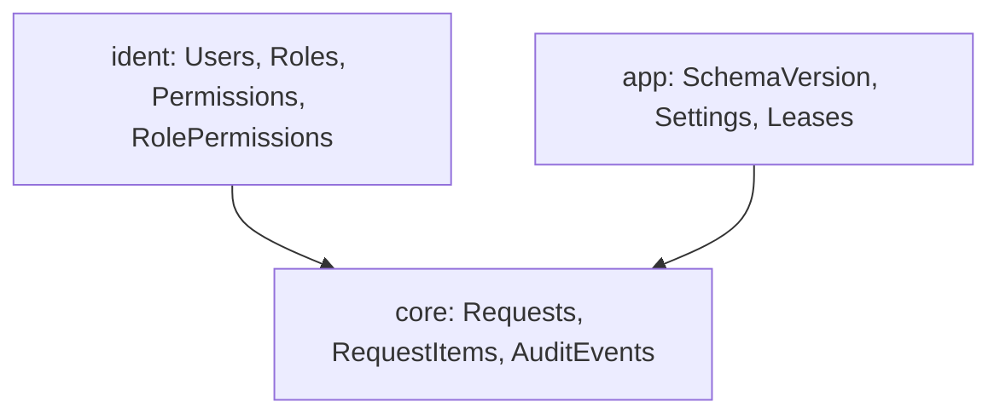

# Data model

| | |
|---|---|
| **Status** | Proposed (2026-10-09); becomes Accepted with the first migration review at the schema gate <!-- FILL: name the G-nn gate from docs/orchestration/README.md --> |
| **Decisions** | <!-- FILL: the ADRs this document applies, e.g. "ADR-005 (database conventions), ADR-006 (migrations and compatibility window)" --> |
| **Sources** | [RFC-001](rfc/RFC-001-rosetta.md), [requirements](spec/requirements.md) (RF/RNF ids cited per table), [architecture](architecture.md) sections 5 and 14 |
| **Owner of changes** | any schema change = a new numbered migration + an edit of this document in the same branch; the verifier rejects one without the other |

This document is the contract between the domain model ([architecture](architecture.md) section 5), the
migrations and the builders. It lists every table the first release creates, the tables reserved for later
releases (name and key only), the constraints that carry business rules, the grants per role or service account,
the migration numbering, the test-database strategy, retention, seed data and, when a system is replaced, the
history import mapping. No code.

<!-- FILL: Walk through this document with the product owner table by table before the first migration card is
built (it is the most expensive document to change later). If the project has no relational database, keep the
sections that still apply (conventions, ownership, retention, seed data) under the store's own vocabulary and
mark the rest "Not applicable: <reason>". Engine-specific choices (types, collation, reserved names) come from the
chosen preset. Undecided points become Q-nn in docs/spec/requirements.md with a default and are listed in
section 12. -->

## 1. Conventions

<!-- FILL: The rules below are suggested defaults. Confirm or change each with the owner; a change that affects
several tables or is hard to revert gets an ADR. Keep one rule per row, written so the verifier can check it. -->

| Topic | Rule |
|---|---|
| Database names | one name per environment: `rosetta` (production), `rosetta-test`, `rosetta-dev`, automated tests `rosetta-test-<run>` (created and dropped per run, section 8) <!-- FILL: adapt to the engine's naming rules --> |
| Collation / encoding | one collation or encoding for every environment, checked by the first migration <!-- FILL: value --> |
| Schemas | one schema per area or module, named by its key; nothing in the engine's default schema. Reserved names that must never be used for an application schema: <!-- FILL: the engine's reserved schema names, e.g. SQL Server reserves `sys` and `INFORMATION_SCHEMA`; PostgreSQL reserves `pg_*` and `information_schema` --> |
| Tables | PascalCase plural (`Requests`) or snake_case plural (`requests`), one style for the whole database <!-- FILL: choose --> |
| Keys | surrogate integer identity primary key on every table (`PK_<Table>`); business keys as unique constraints; GUIDs only for identifiers that leave the system (correlation ids, idempotency keys, public ids on the API) |
| Foreign keys | every relationship is a real foreign key (`FK_<Child>_<Parent>`), no cascading deletes across modules; deletions are soft or forbidden |
| Columns | booleans `Is...` / `Has...` not null; UTC instants suffixed `Utc`; business-local dates as a date type next to the UTC instant when a rule needs the local date; money and quantities as fixed-point decimals with a stated scale; all text Unicode |
| Enumerations | stored as the enum member name (text) with a check constraint listing the allowed values; no integer codes, no sentinel values (such as a magic "0000" or a status text in another language) |
| Audit columns | mutable tables: `CreatedUtc`, `CreatedBy`, `ModifiedUtc`, `ModifiedBy`; append-only tables: `CreatedUtc`, `CreatedBy` only |
| Soft delete | catalogue tables carry `IsDeleted`; business records are never deleted by the application, only by the purge of section 9 <!-- FILL: confirm or decide hard delete per table --> |
| Concurrency | a row-version column on every mutable table edited from a page (optimistic concurrency) |
| Constraint and index names | `PK_`, `FK_`, `UQ_`, `CK_`, `IX_` prefixes; every foreign key column indexed; filtered unique indexes for "at most one open" rules |
| JSON columns | only for payload copies that no query filters on, with a validity check |
| Time zones | UTC everywhere; the business time zone is data (a settings row or a per-site row), never code; local dates are computed by the clock port |
| Legacy references | imported rows carry a `LegacySource` text column so every legacy id stays traceable <!-- FILL: keep only when replacing an existing system --> |

## 2. Schema map

<!-- FILL: One node per schema or module with its tables, arrows for foreign keys between schemas. Use flowchart TB
so it prints. -->

## 3. Tables

<!-- FILL: One subsection per schema, one block per table in the shape below: a small facts table (purpose, owner
module, spec ids, the migration that creates it), the columns table (audit columns from section 1 are implied and
not repeated), then keys and indexes. Tables of a later release go to section 4, not here. The two tables below
are examples: keep `SchemaVersion` if the migration runner of section 7 uses it, replace the other. -->

### 3.1 `app` (platform)

#### `app.SchemaVersion`

| | |
|---|---|
| Purpose | one row per applied migration, written by the migration runner; start-up compares the applied set with the set the build embeds |
| Owner module | platform |
| Spec | <!-- FILL: RNF id for deployability or schema compatibility --> |
| Created by | `0000_SchemaVersion` |

| Name | Type | Null | Notes |
|---|---|---|---|
| `Id` | int identity | no | primary key |
| `Version` | int | no | the four-digit migration number; unique |
| `MigrationName` | text(120) | no | file name without extension |
| `Release` | text(20) | no | the release that shipped it |
| `Checksum` | binary(32) | no | SHA-256 of the file |
| `AppliedUtc` | datetime | no | |
| `AppliedBy` | text(256) | no | deploy account |

Keys and indexes: `PK_SchemaVersion (Id)`, `UQ_SchemaVersion_Version (Version)`.

### 3.2 `core` <!-- FILL: schema name, RF range and ADRs, e.g. "(RF-001..099, ADR-004)" -->

#### `core.Requests` <!-- FILL: example table, replace -->

| | |
|---|---|
| Purpose | one row per request raised by a user |
| Owner module | <!-- FILL --> |
| Spec | RF-001..RF-010 |
| Created by | `0010_Requests` (card P1-03) |

| Name | Type | Null | Notes |
|---|---|---|---|
| `Id` | int identity | no | primary key |
| `ReferenceNumber` | text(12) | no | business key, format checked by `CK_Requests_ReferenceNumber` |
| `State` | text(30) | no | enum name; `CK_Requests_State` lists `Draft`, `Submitted`, `Closed` |
| `SubmittedUtc` | datetime | yes | set once on submit, never cleared |
| `RowVersion` | row version | no | optimistic concurrency |

Keys and indexes: `PK_Requests (Id)`, `UQ_Requests_ReferenceNumber (ReferenceNumber)`,
`IX_Requests_State (State, SubmittedUtc)`.

## 4. Reserved for later releases

<!-- FILL: Tables a later release will need, with name, key and the RF range, so nobody takes the name or builds a
conflicting shape. They are created only by the release that uses them. -->

| Release | Tables (schema) | Key | Spec |
|---|---|---|---|
| <!-- FILL: example row, replace --> R2 | `core.RequestAttachments` | `RequestId`, `Ordinal` | RF-200..209 |

## 5. Constraints that carry business rules (verifier checklist)

<!-- FILL: Every business rule the database enforces, one row each. The verifier checks each one exists in the
migrations and has a test that proves it. -->

| Rule | Where |
|---|---|
| <!-- FILL: example row, replace --> One reference number per request | `UQ_Requests_ReferenceNumber` |
| States are a closed set | `CK_` on every enum column |
| No sentinel values | the verifier greps migrations and code for the forbidden literals listed in CLAUDE.md |

## 6. Grants per role or service account

<!-- FILL: The least-privilege accounts the application and jobs use (for example Reader, Writer, Admin, LogWriter,
Deploy), with rights per schema and the object-level exceptions. The deploy account is used only by the migration
runner and seeds, never by the running application. Passwords and connection strings never appear here or in the
repository (docs/environments-and-delivery.md section 4). -->

Legend: S = SELECT, I = INSERT, U = UPDATE, D = DELETE, X = EXECUTE.

Schema-level grants (issued by the logins migration; a module schema's by the first migration of its block):

| Schema | Reader | Writer | Admin | Deploy |
|---|---|---|---|---|
| <!-- FILL: example row, replace --> core | S | S, I, U | S | owner |
| app | S | S | S | owner |

Object-level grants and denies (issued by the migration that creates the object):

| Object | Grant | Issued by |
|---|---|---|
| <!-- FILL: example row, replace --> `core.AuditEvents` | Admin DENY U, D | `0010_Requests` |

Process or job to account:

| Process | Account |
|---|---|
| <!-- FILL: example row, replace --> Web request pipeline | Writer (writes), Reader (lists, reports), Admin (admin pages) |
| Migration runner, seeds | Deploy |

## 7. Migrations

- File name `<migrations folder>/NNNN_Name.sql` (four digits), idempotent (every object guarded by an existence
  check, seeds as upserts), each ending with its `app.SchemaVersion` row. <!-- FILL: runner name and its
  parameters, or the migration tool the preset uses. -->
- Never edit an applied migration; a fix is a new migration. Never run a down-migration in production.
- **Number ranges** so parallel builders never collide:

  | Range | Owner |
  |---|---|
  | 0000-0009 | platform baseline (first scaffolding card) |
  | 0010-0019 | <!-- FILL: example row, replace --> other P1 cards |
  | 0090-0099 | core hotfixes of release 1 |
  | 0100-0149 | <!-- FILL: example row, replace --> module A |
  | 0150-0199 | <!-- FILL: example row, replace --> module B |

- **Per-card files** (a card uses the number fixed here; a follow-up takes the next free number of its owner's
  hotfix range):

  | File | Card | Creates |
  |---|---|---|
  | `0000_SchemaVersion` | P1-01 | `app` schema, `app.SchemaVersion` |
  | <!-- FILL: example row, replace --> `0010_Requests` | P1-03 | `core.Requests` + its grants |

- **Compatibility window**: <!-- FILL: the rule between application and schema versions. Suggested default (N-1):
  a migration never drops or renames a column the previous build uses; it adds, backfills and marks, and the drop
  comes one release later, so the previous build still runs on the new schema and a rollback is only a redeploy
  of the previous build. The build embeds its expected migration set; start-up refuses a database that is behind
  or ahead outside the window. Compare the whole set, never only the highest number. -->

## 8. Test database strategy

<!-- FILL: How integration and end-to-end tests get a database: suggested default is a fresh database per test run
(name with a timestamp), every migration applied, a minimal seed, dropped at the end, leftovers older than a day
dropped by the next run. Unit tests never touch a database. Test connection strings come from user secrets or
environment variables, never from source. -->

## 9. Retention and purge

<!-- FILL: How long each kind of data is kept, what happens at the end (delete or blank the payload), which job
does it with which account, and what is never purged (for example records still unresolved). Retention periods
that come from law or policy cite their source and a DEC-nn. -->

| Data | Retain | Action | Job and account | Never purged when |
|---|---|---|---|---|
| <!-- FILL: example row, replace --> Application logs | 90 days | delete in batches | log retention job, Admin | an open incident references it |
| <!-- FILL: example row, replace --> Business records | 3 years | delete through a purge procedure | business purge job, Admin | the record is not in a final state |

## 10. Seed data

<!-- FILL: Every seed: reference data every environment needs (in migrations), site or tenant data (a separate seed
script, not a migration, so the schema stays identical everywhere), demo data (development only, behind a flag),
and the minimal test seed of section 8. -->

| Seed | Kind | Where | Run by |
|---|---|---|---|
| <!-- FILL: example row, replace --> Languages, permission catalogue | reference | migrations | migration runner |
| <!-- FILL: example row, replace --> Demo requests | demo | `seeds/demo.sql` | runner with the demo flag, development only |

## 11. History import mapping (optional)

<!-- FILL: Only when the project replaces an existing system (see docs/legacy-sources.md). One row per legacy table:
where its rows land, how values are transformed, and what is deliberately not imported. The import tool runs with
a read-only account on a restored backup, supports a dry run, is idempotent by `LegacySource`, and reports rows it
cannot map instead of inventing values. Map legacy states explicitly in a second table. Delete this section when
nothing is imported. -->

| Legacy | New | Notes |
|---|---|---|
| <!-- FILL: example row, replace --> `OldRequests` | `core.Requests` | status text mapped per 11.1; unmappable rows reported |

## 12. Open points for the schema review

<!-- FILL: Every undecided data question, each linked to its Q-nn in docs/spec/requirements.md with the default that
applies until it is answered. -->

- <!-- FILL: example, replace --> Q-01: keep a JSON copy of the external header record for support? Default: no.
