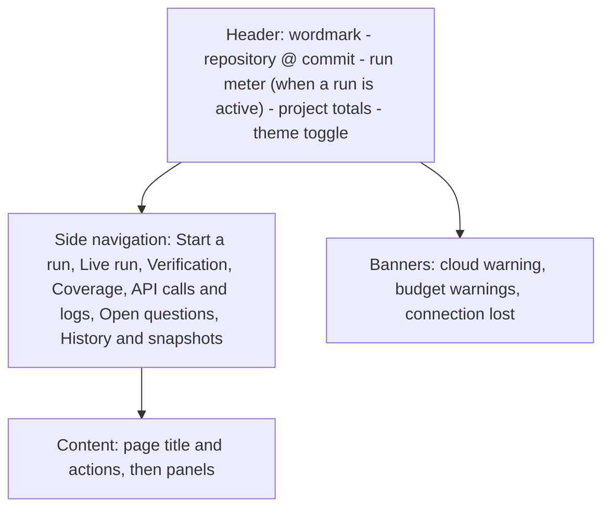

# Design system

| | |
|---|---|
| **Status** | Accepted, v1 (2026-10-11): design board approved by BlackLigth (blacklight0101) at G-02 with no changes (DEC-56); new screens for the hosted application pending (section 14, DEC-63) |
| **Decisions** | DEC-44 (text wordmark, system fonts, deep teal accent, light and dark per OS, multi-page static report), DEC-45 (English only), DEC-46 (verbose, graphic live web UI), DEC-49 (project totals always visible), DEC-50 (API calls and logs), DEC-52 (Preact + Vite), DEC-55 (delete with confirmation); [ADR-012](adr/ADR-012-local-web-ui-and-github-sources.md) |
| **Source artefacts** | [design-system-brief.md](design-system-brief.md) (what was asked); the v1 design board, exported to [`docs/design/board/`](design/board/) (open the `.dc.html` files in the design canvas; never edited after export); [`docs/design/tokens.css`](design/tokens.css) (the token file) |
| **Devices** | desktop and laptop browsers, 1280 px and wider, mouse and keyboard (the web UI); the landing page, sign-in and the published report also on tablets and phones (360 px and wider) |
| **Feeds** | the web UI shell card, the component gallery card, each web UI page card (RF-1000..RF-1012), the report cards (RF-500..RF-506), the landing page (RF-1200), sign-in, settings and administration (RF-1100..RF-1109) |
| **Ancestry** | none |

Every page of the web UI and the report is built with the tokens, components and patterns here. A page that needs a
new component or token adds it to this document in the same branch. Hard-coded colours, sizes, fonts or user text
in a page fail verification.

## 1. Principles

1. **Show the work.** The live UI exists to make the agents visible (DEC-46): every agent, its current tool call,
   the files it read, the cards it found, the verdicts and the cost appear as they happen. Prefer showing a real
   event to summarising it.
2. **Cost is never out of sight.** The header carries the project's total tokens and cost on every page, and the
   run's meter against its cap while a run is active (DEC-49, RF-1003, RF-1010).
3. **Every claim is one click from its evidence.** Citations render as GitHub permalinks to the exact lines
   (RF-125); a verdict always shows its reason.
4. **State is visible and honest.** Every status has one badge with a glyph and a word; colour alone never carries
   meaning. Loud (solid) for states that need a person or a decision, calm (tint) for progress and done.
5. **Nothing hard-coded.** Colours, sizes, radius, fonts, z-index and motion come from tokens; components read
   semantic tokens, never raw values, so both themes work without overrides.
6. **Calm under load.** A run can emit many events a second; the UI batches updates (at most every 250 ms per
   panel), never moves content under the pointer, and can pause live updates without stopping the run.
7. **Works without JavaScript where it is a document.** The report is a static site; JavaScript only adds filters
   and the replay player (DEC-44).

## 2. Tokens

The token file is [`docs/design/tokens.css`](design/tokens.css); the build copies it to the web UI and report
assets unchanged. Custom properties carry the prefix `--rst-`. Themes are applied with `data-theme="light"` or
`data-theme="dark"` on the root element; with no attribute the UI follows the operating system
(`prefers-color-scheme`), and a toggle in the header overrides it per browser (kept in `localStorage`). Every text
and background pair below was measured on 2026-10-11 and passes WCAG 2.1 AA; the lowest pairs are listed in 2.1.

### 2.1 Colour

| Token | Light | Dark | Use |
|---|---|---|---|
| `bg` | `#F4F6F6` | `#0D1413` | page background |
| `surface` / `surface-2` / `surface-raised` | `#FFFFFF` / `#EAEFEE` / `#FFFFFF` | `#141D1C` / `#1B2625` / `#212E2D` | cards and inputs / headers, wells, table heads / dialogs |
| `ink` / `ink-soft` / `ink-muted` | `#13201F` / `#364644` / `#56645F` | `#E5EDEC` / `#BAC8C6` / `#93A5A2` | text |
| `rule` / `rule-strong` | `#D8DFDE` / `#7A8987` | `#2A3836` / `#66807C` | separators / control borders (at least 3:1) |
| `brand` / `brand-hover` / `brand-ink` / `brand-tint` | `#0E6B6B` / `#0A5555` / `#FFFFFF` / `#DDEFEE` | `#45B8B0` / `#64CBC4` / `#04201E` / `#123533` | primary actions, active navigation, links / text on brand / selected navigation |
| `ok-*` (`-ink`, `-bg`, `-solid`, `-solid-ink`) | `#1C6E37`, `#E2F2E7`, `#1C6E37`, `#FFFFFF` | `#63CC88`, `#12301D`, `#3DAA62`, `#04140A` | success, supported, done |
| `warn-*` | `#7A4A00`, `#FBEBD2`, `#E39A1F`, `#1F1500` | `#F2BA5C`, `#36270B`, `#E39A1F`, `#1F1500` | cap reached, retried, unverified, open questions |
| `danger-*` | `#A8211A`, `#FBE4E2`, `#B42318`, `#FFFFFF` | `#FF8E84`, `#3C1513`, `#EA5E55`, `#1C0403` | rejected, failed, delete, stop |
| `info-*` | `#1B5799`, `#E2ECF8`, `#1B5799`, `#FFFFFF` | `#84B9F2`, `#10253D`, `#5B9DE4`, `#04121F` | running, in progress |
| `neutral-*` | `#45524F`, `#E8ECEB`, `#56645F`, `#FFFFFF` | `#BAC8C6`, `#222E2D`, `#93A5A2`, `#0D1413` | planned, proposed, interrupted |
| `role-reader` / `role-verifier` / `role-planner` / `role-summariser` | `#0E6B6B` / `#6A48B8` / `#B5520B` / `#1B5799` | `#45B8B0` / `#A98BF0` / `#F09A55` / `#84B9F2` | the agent role's dot, timeline lane and read bar; always next to the role's name |
| `focus` | `#1B5799` | `#84B9F2` | 2 px focus outline, 2 px offset |
| `scrim` | `rgba(10,20,19,.55)` | `rgba(0,0,0,.6)` | behind dialogs |

Lowest measured pairs: light `rule-strong` on `surface-2` 3.14:1, `rule-strong` on `bg` 3.36:1 (control borders,
need 3:1), `role-planner` on `surface-2` 4.33:1 (graphic, needs 3:1), `ink-muted` on `brand-tint` 5.22:1; dark
`rule-strong` on `surface-2` 3.66:1, `ink-muted` on `brand-tint` 5.15:1. Every text pair is at least 4.5:1.

### 2.2 Type

| Token | Value | Use |
|---|---|---|
| `sans` | `system-ui, -apple-system, "Segoe UI", "Noto Sans", "Helvetica Neue", sans-serif` | everything (DEC-44: system fonts, nothing downloaded) |
| `mono` | `ui-monospace, "Cascadia Code", "SF Mono", Menlo, Consolas, monospace` | paths, citations, card and run ids, SHAs, model names, events, logs |
| `fs-xs` .. `fs-3xl` | 12, 13, 14, 16, 20, 24, 32 px | captions to page titles; body is `fs-md` 14 px |
| `fw-body` / `fw-label` / `fw-head` | 400 / 500 / 650 | |
| `lh-body` / `lh-head` | 1.45 / 1.2 | |

All numbers use tabular figures (`font-variant-numeric: tabular-nums` on the root), so counters do not jitter while
they update. The wordmark is the word "Rosetta" in the sans stack, weight 700, letter-spacing -0.02em; there is no
logo (DEC-44).

### 2.3 Spacing

| Token | Value |
|---|---|
| `sp-1` .. `sp-8` | 4, 8, 12, 16, 24, 32, 48, 64 px |

### 2.4 Radius

| Token | Value |
|---|---|
| `radius-sm` / `radius-md` / `radius-lg` / `radius-pill` | 4 / 6 / 10 / 999 px |

### 2.5 Elevation

| Token | Light | Dark | Use |
|---|---|---|---|
| `shadow-1` / `shadow-2` | soft 1-2 px / 12 px 32 px blur | stronger, same geometry | cards / dialogs |
| `z-menu` / `z-banner` / `z-dialog` / `z-toast` | 40 / 45 / 50 / 60 | same | stacking order |

### 2.6 Motion

| Token | Value | Use |
|---|---|---|
| `dur-fast` / `dur-base` | 120 / 200 ms | state transitions, panel updates |
| `ease` | `cubic-bezier(0.2, 0, 0, 1)` | |

The only looping animation is the "live" dot on running states (1.4 s pulse). Reduced-motion preference sets every
duration to 0 and stops the pulse.

### 2.7 Density

One density: `control-h` 32 px, `row-h` 36 px, minimum hit size `touch` 44 px for the report on touch devices. The
web UI targets desktop only, so no second density is defined.

## 3. Layout

**Web UI** (desktop, 1280 px and wider):

| Width | Navigation | Notes |
|---|---|---|
| 1440 px and wider | side navigation, 200-240 px | agent panels in up to 4 columns |
| 1280-1439 px | side navigation | agent panels in 3 columns |
| below 1280 px | side navigation stacks above content | supported but not optimised; nothing is hidden |

**Report** (static site, any width from 360 px): header with wordmark and the run's identity, tab navigation
(Dashboard, Areas, Cards, Open questions, Run replay, Cost), centred content up to 1180 px wide; summary cards
reflow from four columns to one.

## 4. Input and ergonomics

- Keyboard: logical tab order; Enter submits the start form; Esc closes dialogs and returns focus to the button that
  opened them; tables are navigable rows of links and buttons.
- Long operations: the run itself is the long operation; every page shows its state badge and elapsed time. Buttons
  that start work show a busy state and cannot be pressed twice.
- Connection loss: if the event stream drops, a banner says "Live updates paused - reconnecting", the page keeps its
  last state, and on reconnection missed events are replayed from `events.jsonl` (RF-1006).
- Pause updates: the live run page can freeze its panels for reading while the run continues; a counter shows how
  many events are waiting.

## 5. Component inventory

All components share: a CSS class per component (`rst-<component>`), a test id per part, the focus outline, sizes
from tokens, and English text (DEC-45).

| Component | Variants | States | ARIA / keyboard | Notes |
|---|---|---|---|---|
| Header totals | project only; project + run meter | idle, live | totals are a labelled group; the run meter is `role="meter"` | always on screen (RF-1010); Breakdown opens per run, stage, provider and model |
| Button | primary, secondary, ghost, danger, danger-outline | default, hover, focus, active, disabled (with reason), busy | native `button`; disabled ones keep a `title` with the reason | Stop run and Delete are the only danger buttons |
| Field | URL, text, select, radio, checkbox | default, focus, invalid, disabled | label bound to input; `aria-describedby` for help and the error | URL errors show the `RST` code and a plain sentence |
| Status badge | tint, solid | per section 6 | glyph is `aria-hidden`, the word is the label | one component for every state list |
| Pipeline stepper | - | done, current (live), waiting | ordered list; current step `aria-current="step"` | Snapshot, Scan, Understand, Verify, Report |
| Stat card | - | - | - | label, big number, caption; numbers tabular |
| Agent panel | reader, verifier, planner, summariser | planned, running, done, failed and the other `AgentTaskState` values | `article` with the area as heading | role dot, area, model, current tool call, turn, files read, tokens, cost, read bar, card chips |
| Timeline | live, replay | - | lanes are a list; each bar has a text alternative | one lane per agent, coloured by role; time axis |
| Event stream | live, replay | - | `aria-live="polite"`, throttled | time, event type coloured by kind, one-line text; newest first |
| Data table | calls, runs, snapshots, cards | default, highlighted (error), selected | real `table` with headers; wide tables scroll inside a box | filter bar above; numeric columns right-aligned |
| Cost meter | run, role | under 80%, 80-95% (warn), 95%+ (danger) | `role="meter"` with value and label | marker at the likely estimate |
| Callout | warning, error, info | - | `role="alert"` for the cloud warning and errors | cloud warning includes the consent checkbox (RF-143) |
| Dialog | confirm, destructive confirm | open | `role="dialog"`, `aria-modal`, focus trapped and restored | destructive confirm names the target, space freed, and what is kept |
| Card view | FEAT, BR, ENT, INT, OQ | - | heading per card | id, title, area, confidence, summary, claims with status, verdict reason and permalink |
| Replay player | - | playing, paused | buttons with `aria-label`; speed select | step back, play or pause, step forward, speed 1x/4x/16x |
| Log list | - | - | list; level toggles are `aria-pressed` buttons | time, level, logger, message |

A component gallery page (development only, served at `/__gallery` to administrators, only when `ROSETTA_GALLERY=1`) renders every
component in every state and both themes; the end-to-end suite screenshots it.

## 6. Status badges

The state lists are canonical in [architecture](architecture.md) section 5; this table adds only their presentation.

| State | Tone | Weight | Glyph | Meaning for the user |
|---|---|---|---|---|
| Claim `Proposed` | neutral | tint | open circle | an agent made the claim; not checked yet |
| Claim `CitationInvalid` | danger | tint | broken link | the cited file or lines do not exist |
| Claim `Supported` | ok | solid | check | the verifier agrees with the evidence |
| Claim `Rejected` | danger | solid | cross | the evidence does not support the claim; kept, with the reason |
| Claim `Unverified` | warn | tint | question mark | not checked because the run stopped; resume to check |
| Agent `Planned` | neutral | tint | dashed circle | waiting to start |
| Agent `Running` | info | solid | live dot | working now |
| Agent `Done` | ok | tint | check | finished normally |
| Agent `TurnLimitReached` | warn | tint | clock | stopped at the turn limit; cards so far are kept |
| Agent `InvalidOutput` | danger | tint | brackets | the model's answer could not be parsed after one repair |
| Agent `Failed` | danger | solid | exclamation | stopped by an error |
| Agent `StoppedByCap` | warn | solid | square | stopped because the budget cap was reached |
| Run `Completed` | ok | solid | check | |
| Run `CapReached` | warn | solid | square | raise the cap and resume to finish |
| Run `Failed` | danger | solid | exclamation | see the log and the error code |
| Run `Interrupted` | neutral | solid | pause bars | stopped by the developer |
| Question `Open` / `Answered` | warn tint / ok tint | | question mark / check | |
| Call `ok` / `retried` / `failed` / `refused-by-cap` | ok tint / warn tint / danger solid / warn solid | | HTTP code or glyph | provider call status (RF-408) |

## 7. Patterns

- **Start a run**: URL field, Resolve shows repository, pinned commit, subpath, licence and whether the snapshot is
  cached; stage and areas; the estimate table (low, likely, high per role); the cloud warning with a consent
  checkbox when a role uses a cloud provider; Start is enabled only when the URL resolved and consent is given.
- **Destructive confirmation**: a dialog that names the target, the space it frees, what is kept (the snapshot, the
  project totals), and "This cannot be undone"; the danger button repeats the verb ("Delete run").
- **Disabled with a reason**: a control that cannot be used says why in its label or title ("Delete (in use)").
- **Errors**: the `RST-xxxx` code, what happened and what to do, next to the field or in an error callout
  ([conventions](conventions.md) section 6).
- **Empty states**: one sentence and the next action ("No runs yet. Start a run.").
- **Live numbers**: counters update in place without animation; the event stream inserts at the top and keeps the
  scroll position when the reader has scrolled down.
- **Illustrative data**: mock-ups use plausible example numbers; real figures always come from the run files.

## 8. Accessibility

Baseline WCAG 2.1 AA: contrast per section 2.1, control borders at least 3:1, a visible focus outline on everything
interactive, labels bound to inputs, status carried by glyph and word, dialogs trap and restore focus, live regions
throttled so screen readers are not flooded (at most one announcement per panel every 5 seconds, summaries rather
than every event), the page language is `en`, reduced motion honoured, no content lost at 200 % zoom at 1280 px.
Tested with axe in the Playwright suite on every page and the component gallery (RNF-010, DEC-52).

## 9. Iconography

Inline SVG only, drawn in the component code, 12-20 px, stroke 1.5-1.8 px, colour `currentColor`; no icon font and
no CDN. Icons next to a word are `aria-hidden`; an icon-only button has an `aria-label`. Set: check, cross, open
circle, dashed circle, live dot, broken link, question mark, clock, brackets, exclamation, square, pause bars, retry
arrow, warning triangle, play, step back, step forward.

## 10. Content style

English only (DEC-45). Sentence case for titles, labels and buttons. Buttons start with a verb ("Start run",
"Delete run"). Numbers with thousands separators; costs in USD with `$`, four decimals below $1 and two above
(DEC-54); tokens abbreviated with `k` and `M` only in compact places, exact in tables. Times in 24-hour format, local
time zone in the UI, UTC in files. Ids, paths and model names in the mono font, never translated or shortened in
the middle. Errors say what happened, what to do, and the code.

## 11. Terminal output

Withdrawn 2026-10-11 with the command-line interface (DEC-59, RF-004). Kept for reference: the CLI shared the vocabulary of the web UI (DEC-44): one compact line per event in colour (ANSI 16 colours mapped
to the tones: info blue, ok green, warn yellow, danger red), state words identical to section 6, the run meter on
one line that updates in place in a terminal; no spinners and no in-place updates when standard output is not a
terminal; `NO_COLOR` turns colour off (RF-004).

## 12. Naming and files

- Token prefix: `rst`; CSS classes `rst-<component>[__part][--variant]`; no inline styles except computed sizes and
  role colours bound to data.
- Components: PascalCase Preact components in `web/src/components/<Component>.tsx`, one per file, shared by the web UI
  and the report (ADR-012).
- Files: tokens `web/src/styles/tokens.css` (copied from `docs/design/tokens.css`), base styles
  `web/src/styles/base.css`, the gallery `web/src/gallery/`.
- Test ids `<component>-<part>`.

## 13. Verification

- Unit tests: the status-to-badge map covers every value of every state list in architecture section 5.
- The component gallery renders in both themes; Playwright screenshots it and runs axe.
- `web/src/styles/tokens.css` equals `docs/design/tokens.css` (a test compares them).
- The verifier greps components and pages for colour literals, pixel sizes outside tokens, inline styles other than
  the allowed ones, and font or icon CDN links.

## 14. Pending screens for the hosted application (added 2026-10-11)

DEC-59..DEC-69 add screens the v1 board does not show. They use only the tokens and components above where they
fit; a new component is added to section 5 in the same branch. The artboards are drawn and approved before their
cards are built (an amendment of G-02, recorded in `handoff.md`).

| Screen | Requirements | Notes |
|---|---|---|
| Landing page | RF-1200, RF-1201 | product-quality marketing page: hero with the one-sentence promise, the pipeline as a graphic, a still of the live agent view, evidence cards with the verifier, cost control, security and privacy, technology, about the project, Sign in and Request access; works from 360 px and without JavaScript; light and dark |
| Sign in | RF-1100 | user name, password, one generic error, lockout message; centred card on the landing background |
| Change password | RF-1103, RF-1102 | forced at first sign-in; rules shown before typing |
| Projects | RF-010, RF-1105 | the user's projects with last run, totals, New project |
| Settings and keys | RF-1104, RF-407 | per provider: last four characters, replace, delete, Test; which key a run will use |
| Administration: users | RF-1102, RF-1106, RF-1107 | table of accounts with role, state, last sign-in, month-to-date cost; create, disable, reset; caps form; server month meter with the 80% banner |
| Administration: audit | RF-1109 | filterable table, last 30 days |
| Run queue state | RF-1108 | a `Queued` badge with the position on the start page and the run list |
