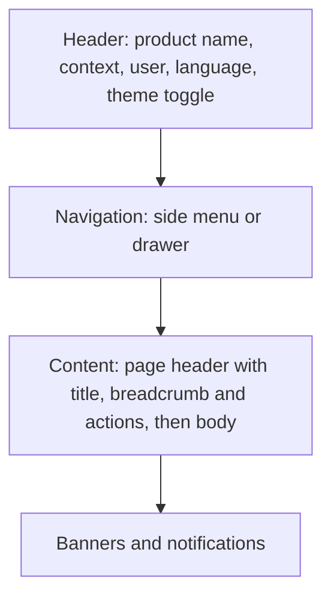

# Design system

| | |
|---|---|
| **Status** | Proposed, v1 draft (2026-10-09) <!-- FILL: "Proposed, v1 draft" until the design-tool round trip returns; then "Accepted, v2 from the design board of YYYY-MM-DD, accepted by BlackLigth (blacklight0101) on YYYY-MM-DD" --> |
| **Decisions** | <!-- FILL: the ADRs this document applies, e.g. "ADR-007 (own components on design tokens, no UI library)"; theme and density rules; brand inputs still pending --> |
| **Source artefacts** | [design-system-brief.md](design-system-brief.md) (what was asked); `docs/design/board/` (what came back: the board files and the token file, kept unedited) |
| **Devices** | <!-- FILL: every device class with its resolution and input, e.g. "desktop 1920 x 1080 mouse and keyboard; tablet 768 px touch" --> |
| **Feeds** | <!-- FILL: the task cards that build from this document (tokens and shell, component gallery, each page card) --> |
| **Ancestry** | <!-- FILL: an earlier product whose tokens, theme script or components are ported, or "none" --> |

Every page is built with the tokens, components and patterns here. A page that needs a new component or token
adds it to this document in the same branch. Hard-coded colours, sizes, fonts or user text in a page fail
verification.

<!-- FILL: This template is filled twice. First pass (v1): write a draft from the interview (users, devices, brand
inputs, screens) and send it inside docs/design-system-brief.md to a design tool (for example Claude Design).
Second pass (v2): when the board comes back, export it to docs/design/board/ (never edit those files afterwards),
fold its tokens, component specs and critique into this document, fill section 0 with what changed and why, and
set the Status to v2. Where a board file disagrees with this document or an ADR later, this document wins and the
board stays as history. Token names below are written without the project prefix; the full custom-property name
is the prefix of section 12 plus the name (for example a prefix of "abc" gives the property "abc-bg"). -->

## 0. What changed from v1 (the board's critique, adopted)

<!-- FILL: Only in v2. One row per change the design round trip made, with the reason, so later readers know which
v1 idea was rejected and why. Delete this section in v1. -->

| v1 | v2 | Why |
|---|---|---|
| <!-- FILL: example row, replace --> density from viewport width | density from the device record or a user toggle | density is a property of the device, not the window |

## 1. Principles

<!-- FILL: Three to seven principles that decide arguments, each with the concrete rule it implies. Examples of the
kind: "Nothing hard-coded: colours, sizes, fonts, motion come from tokens, text from resources"; "State is visible
and honest: every status has one badge with a glyph and a word"; "Print is a first-class output". -->

1. **Nothing hard-coded.** Colours, sizes, radius, fonts, z-index and motion come from tokens; text comes from
   resources ([conventions](conventions.md) section 11). Components read semantic tokens, never the primitives,
   so density and theme work without overrides.
2. <!-- FILL -->

## 2. Tokens

<!-- FILL: The token file lives at <path in the app> and, in v2, is copied verbatim from docs/design/board/. Say
how themes and densities are applied (for example attributes data-theme and data-density on the root element,
scoped so a region such as the component gallery can carry its own), whether the OS colour-scheme preference is
followed, and where the contrast measurements come from. Every text and background pair must pass WCAG 2.1 AA
(4.5:1 body text, 3:1 large text and control borders); record the lowest measured pairs here. -->

### 2.1 Colour

| Token | Light | Dark | Use |
|---|---|---|---|
| `bg` | <!-- FILL --> | <!-- FILL --> | page background |
| `surface` / `surface-2` / `surface-raised` | <!-- FILL --> | <!-- FILL --> | cards and inputs / headers and wells / dialogs |
| `ink` / `ink-soft` / `ink-muted` | <!-- FILL --> | <!-- FILL --> | text; muted still at least 4.5:1 on every surface |
| `rule` / `rule-strong` | <!-- FILL --> | <!-- FILL --> | decorative separators / input and control borders at least 3:1 |
| `brand` / `brand-hover` / `brand-ink` | <!-- FILL --> | <!-- FILL --> | primary actions, active navigation, links |
| `ok`, `warn`, `danger`, `info`, `neutral` sets (`-ink`, `-bg`, `-solid`, `-solid-ink`) | <!-- FILL --> | <!-- FILL --> | status tones for icons and borders, tinted and solid badges |
| `focus` / `focus-ring` | <!-- FILL --> | <!-- FILL --> | focus indicator on everything interactive, visible on every tone |
| `scrim` | <!-- FILL --> | <!-- FILL --> | behind dialogs |

### 2.2 Type

| Token | Value | Use |
|---|---|---|
| `sans` / `mono` | <!-- FILL: font stacks; fonts self-hosted or not; scripts covered (Latin, Cyrillic, ...) --> | body / codes, identifiers, numbers read aloud |
| `fs-xs` ... `fs-3xl` | <!-- FILL: scale in px per density, see 2.7 --> | hints to page titles |
| `fw-body` / `fw-label` / `fw-head` | <!-- FILL: e.g. 400 / 500 / 600 --> | |
| `lh-body` / `lh-head` | <!-- FILL: e.g. 1.45 / 1.2 --> | |

Numbers in tables and counters use tabular figures. Identifiers and codes use the mono stack.

### 2.3 Spacing

| Token | Value | Use |
|---|---|---|
| `sp-1` ... `sp-8` | <!-- FILL: e.g. 4, 8, 12, 16, 24, 32, 48, 64 px --> | primitives; components use the semantic tokens of 2.7 |

### 2.4 Radius

| Token | Value |
|---|---|
| `radius-sm` / `radius-md` / `radius-lg` / `radius-pill` | <!-- FILL: e.g. 4 / 6 / 10 / 999 px --> |

### 2.5 Elevation

| Token | Light | Dark | Use |
|---|---|---|---|
| `shadow-1` / `shadow-2` | <!-- FILL --> | <!-- FILL --> | raised surfaces / dialogs |
| `z-menu` / `z-banner` / `z-dialog` / `z-toast` | <!-- FILL: e.g. 40 / 45 / 50 / 60 --> | same | stacking order |

### 2.6 Motion

| Token | Value | Use |
|---|---|---|
| `dur-fast` / `dur-base` | <!-- FILL: e.g. 120 / 200 ms --> | state transitions |
| `ease` | <!-- FILL --> | |

Reduced-motion preference sets every duration to 0.

### 2.7 Density (semantic tokens)

<!-- FILL: Only when devices differ enough to need two densities (for example desktop and touch). Components read
these tokens; primitives never change. Delete if one density serves every device. -->

| Token | Desktop | Touch / compact | Use |
|---|---|---|---|
| `fs-body` | <!-- FILL --> | <!-- FILL --> | default body size |
| `control-h` / `action-h` | <!-- FILL --> | <!-- FILL --> | inputs and buttons / page primary action |
| `row-h` | <!-- FILL --> | <!-- FILL --> | grid rows |
| `gap` / `pad` / `section` | <!-- FILL --> | <!-- FILL --> | layout rhythm |
| `touch` | 44 | 44 | minimum hit size in px |

## 3. Layout and density per device

<!-- FILL: The page shell (header, navigation, content, banners) as a diagram, then how navigation and density
behave per width and device class. Say which pages are supported on the smallest device and what the others show
there (a notice, never a broken layout). -->

| Width or device | Navigation | Density |
|---|---|---|
| <!-- FILL: example row, replace --> 1440 px and wider | expanded side menu | desktop |
| <!-- FILL: example row, replace --> below 768 px | drawer | touch; admin pages show a "use a larger screen" notice |

## 4. Input and ergonomics

<!-- FILL: Keyboard (tab order, Enter and Esc in dialogs, arrow keys in grids), touch (no hover-only affordances,
visible row actions), special input devices if any (scanners, game controllers, pens), long operations (busy state
with elapsed time; double-submit guard backed by server idempotency), connection loss (banner, actions paused,
nothing queued silently), text expansion for longer languages (no fixed-width buttons). -->

## 5. Component inventory

<!-- FILL: Every owned component, with its variants, states, accessibility contract and implementation notes. All
components share: a CSS class per component, resource keys for every visible text, a test id per part, the focus
ring token, sizes from the density tokens. The two rows are examples. -->

| Component | Variants | States | ARIA / keyboard | Notes |
|---|---|---|---|---|
| <!-- FILL: example row, replace --> Button | primary, secondary, ghost, danger | default, hover, focus, active, disabled, busy | native button; busy sets aria-busy; Enter and Space | never icon-only for a primary action |
| <!-- FILL: example row, replace --> Field | text, number, date, select | default, focus, invalid, disabled, read-only | label bound to input; aria-describedby for help and error | error text from the form's validation |

A component gallery page (development only, not in the menu) renders every component in every state, theme and
density; the end-to-end suite screenshots it.

## 6. Status badges

<!-- FILL: One row per state of every state machine the user sees, with tone, weight and glyph. The state lists
themselves are canonical in docs/architecture.md section 5; this table adds only their presentation. The glyph and the
word are always shown together; colour alone never carries meaning. Loud for states that need a person, calm for
done. -->

| State | Tone | Weight | Glyph | Meaning for the user |
|---|---|---|---|---|
| <!-- FILL: example row, replace --> `Draft` | neutral | tint | circle | created, not submitted |
| <!-- FILL: example row, replace --> `Failed` | danger | solid | exclamation | refused; a person must correct it |

## 7. Patterns

<!-- FILL: The shared rules for forms (validation, busy save, unsaved-changes prompt), destructive confirmations
(dialog, typed reason where the spec requires it), grids (filter bar, sort, page size, export), errors (code, text,
correlation id; [conventions](conventions.md) section 7), loading (skeletons in grids, spinner in buttons), empty
states, success (glyph and word, never colour alone). -->

## 8. Accessibility

Baseline WCAG 2.1 AA: contrast per section 2.1, control borders at least 3:1, a visible focus ring on everything
interactive, labels bound to inputs, status carried by glyph and word, dialogs trap focus and restore it, live
regions for results and status changes, the page language follows the UI language, reduced motion honoured, no
content lost at 200 % zoom on the smallest supported desktop. <!-- FILL: any stricter or additional rule, and how
it is tested. -->

## 9. Iconography

<!-- FILL: Icon source (inline SVG set, no icon font or CDN unless an ADR allows it), grid size per density, stroke,
colour from the current text colour, the list of icons, and the rule for decorative versus labelled icons. -->

## 10. Content style

<!-- FILL: Voice and tone, capitalisation (sentence case for labels and buttons), how actions are named (verb
first), numbers, dates and times (24-hour or 12-hour, time zone shown or not), how errors are worded (what
happened, what to do, the code), words to avoid, and the glossary link for domain terms. -->

## 11. Print

<!-- FILL: Only when the product prints (documents, labels, reports): page sizes, print stylesheet, what is hidden,
fonts, barcodes or images, and how printing is triggered. Delete otherwise. -->

## 12. Naming and files

- Token prefix: <!-- FILL: a short lower-case prefix, usually RST in lower case -->; CSS classes
  `<prefix>-<component>[__part][--variant]`; no inline styles except computed sizes.
- Components: <!-- FILL: naming rule, e.g. a PascalCase prefix plus the name, and their folder -->.
- Files: <!-- FILL: token file, layout and component styles, print styles, scripts, fonts, with their paths -->.
- Resource keys `Ui.<Component>.<Text>`; test ids `<component>-<part>`.

## 13. Verification

<!-- FILL: What proves conformance. Suggested: unit tests for status-to-badge maps and theme or density switches;
the gallery rendered in every theme and density; screenshots in the end-to-end suite; the token file equal to the
board file; the verifier greps pages for colour literals, size literals outside tokens, inline styles, literal
user text and font or icon CDN links. -->
