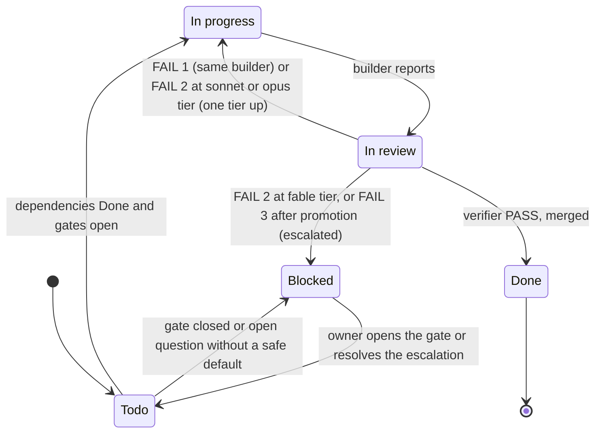

# Orchestration protocol - how Rosetta is built

This document is the operating manual for the **orchestrator** (a Claude session that coordinates the build),
the **builders** (subagents that implement one task card each) and the **verifier** (a subagent on the
strongest model that checks every finished card before it is merged). The cards are in [tasks.md](tasks.md).
The agent definitions the orchestrator spawns are in `.claude/agents/`.

Nothing here changes the design. The RFC, the spec, the ADRs, the architecture and the roadmap remain the
sources of truth; the cards only slice them into deliverable units. Card counts (per phase and per builder tier)
live only in the header of [tasks.md](tasks.md); this document does not repeat them.

<!-- FILL: Adjust every value in section 1 to the project's stack and remove this comment. The values shown are the
house .NET defaults (references/presets/dotnet-house.md in the project-blueprint skill); replace them for another
stack and keep the row when the setting still applies. -->

## 1. Build settings

Every rule below refers to these settings by name, so a stack change is made here once.

| Setting | Value |
|---|---|
| Build command | `dotnet build` (zero errors, zero new warnings) <!-- FILL: e.g. `npm run build`, `./gradlew assembleDebug`, Unity batch-mode build --> |
| Test command | `dotnet test` <!-- FILL: e.g. `npm test`, `./gradlew test`, Unity `-runTests` --> |
| Test-first | on: failing test, then code, then refactor; branch history shows tests before or with the code <!-- FILL: keep "on" unless the owner decided otherwise (record the DEC-nn) --> |
| Test levels | Unit (no I/O), Integration (exactly one real boundary), E2E (a user journey through the running app) |
| Level marker | `[Trait("Level", "Unit" \| "Integration" \| "E2E")]` on every test <!-- FILL: e.g. NUnit `[Category]`, Vitest file suffix `.unit.test.ts`, pytest markers --> |
| Test pyramid | 60 / 30 / 10 (unit / integration / E2E) by test count per release, 10 points tolerance; a guideline that warns (opt-in switch to enforce); a test without a level marker or a run counting zero tests fails <!-- FILL: from bank 7.2; change only with an ADR --> |
| Pyramid report | the script delivered by the E2E harness card; before it is merged, count the tests per level by hand <!-- FILL: name the card id and the script path --> |
| Mutation check | on: the verifier stubs one implementing type in a disposable worktree and confirms at least one test fails |
| E2E tool | Playwright <!-- FILL: e.g. Playwright for .NET, Playwright (Node), Espresso, Unity PlayMode tests --> |
| Page walk | on for cards that deliver or change pages; preview entry `rosetta-web` in `.claude/launch.json`; viewports 1366x768 and 390x844, light and dark <!-- FILL: sizes and color schemes from docs/design-system.md; "off" when the project has no UI --> |
| Design principles | SOLID and KISS (no abstraction, package or generic mechanism the card does not ask for) |
| Branch name | `task/<id>-<kebab-title>` in lower case, e.g. `task/p1-03-authentication` |
| Commit message | `<id>: <title>`, one or more `Refs:` lines, and the attribution line given by the session instructions |
| Merge | `git merge --ff-only` into `main` (rebase the branch first when `main` moved) and check the exit code; linear history; `main` is clean at the end of every session |
| Agents in flight | at most 3, builders and verifiers together <!-- FILL: from bank 8.7 --> |
| Serialized resources | database migrations folder; the composition root; the package and solution manifests <!-- FILL: e.g. `Database/Migrations`, `Program.cs`, `Directory.Packages.props`, `package.json` --> |
| Requirement comment | `// RF-nnn` at each implementing type <!-- FILL: comment syntax of the stack --> |

## 2. Roles

| Role | Agent | Model | Responsibility | May edit |
|---|---|---|---|---|
| Orchestrator | `orchestrator` run as the main session (`claude --agent orchestrator`) or the session itself following this file; never spawned as a subagent, because subagents cannot spawn builders | strongest available | reads this file, `tasks.md` and `handoff.md`; picks ready cards; spawns one builder per card; spawns the verifier for every finished card; merges on PASS; stops at gates and escalations | the Status line of each card, new follow-up cards (section 9), `handoff.md`, the project notes CLAUDE.md names, merges into `main` |
| Builder, sonnet tier | `builder-sonnet` | `sonnet` | routine, well-specified work that follows an existing pattern: scaffolding, CRUD pages, reference data, wiring, fakes, documentation | files inside the card's scope |
| Builder, opus tier | `builder-opus` | `opus` | substantial or cross-cutting work that needs judgement: infrastructure shared by many cards, integration adapters, background jobs, non-trivial state machines, multi-step UI flows | files inside the card's scope |
| Builder, fable tier | `builder-fable` | `fable` | the hardest or riskiest work: security (authentication, authorization, secrets), concurrency and idempotency, data migration and import, anything hard to revert, any card that already failed twice at a lower tier | files inside the card's scope |
| Verifier | `verifier` | `fable` (always the strongest model) | independent check of a finished card against the card, the spec, the ADRs and CLAUDE.md; runs build and tests itself; returns PASS or FAIL with findings; never edits the branch | nothing in the branch (a disposable detached worktree for the mutation check, removed afterwards) |
| Product owner | BlackLigth (blacklight0101) | - | answers open questions, opens human gates, reviews escalations, does what needs access Claude does not have | anything |

**Tier rule of thumb.** If a mistake would leak a credential, grant a permission wrongly, corrupt or lose data,
double an external side effect, or need a manual data fix in production, the card is fable tier. If the card has a
working pattern to copy (in this repository or in a named template repository), it is sonnet tier. Everything else
is opus tier. <!-- FILL: add one project-specific sentence naming the kinds of work that are fable tier here. -->

The tier names follow the Claude model aliases the Agent tool accepts. When models change, keep the criteria and
change only the `model:` lines in `.claude/agents/`; the verifier always runs on the strongest model available.

## 3. Card life cycle



Status values (the only text the orchestrator writes on a card): `Todo`, `In progress`, `In review`, `Done`,
`Blocked (<reason>)`. The reason is a gate (`Blocked (G-01)`), an open question (`Blocked (Q-nn)`), an escalation
(`Blocked (escalated YYYY-MM-DD - see handoff.md)`) or a withdrawal (`Blocked (withdrawn YYYY-MM-DD - see <card id>)`).
When only part of a card waits, the rest runs: `Todo; <part> Blocked (Q-nn)`.

1. **Select.** A card is ready when its Status is `Todo`, every id in *Depends on* is `Done` and every gate it names
   is `Open` in the Gates table of `handoff.md`. Ready cards run in parallel within the limits of section 8. A
   `Provisional` gate releases only the cards its note in `handoff.md` names (usually P1-01 for G-01). When a gate
   opens, the orchestrator sets the cards it held from `Blocked (G-nn)` back to `Todo`.
2. **Brief the builder** with the card verbatim, its *Reads* list, section 1, the builder rules (section 4) and the
   report format (section 6). One card per builder, one builder per card, each in its own worktree and branch.
   Set the Status to `In progress`.
3. **The builder reports.** The orchestrator does not judge the report. It sets the Status to `In review` and spawns
   the verifier with the card, the builder report and the branch name.
4. **The verifier returns** PASS or FAIL (section 5).
   - PASS: merge the branch into `main` with the commit message of section 1, set the Status to `Done`, append one
     line to `handoff.md`, file every MINOR finding as a follow-up card (section 9).
   - FAIL 1: send the findings back to the **same** builder (context intact) for a second round; Status
     `In progress`.
   - FAIL 2 at sonnet or opus tier: re-run the card once with a fresh builder one tier up (never down).
   - FAIL 2 at fable tier (a native fable card): set `Blocked (escalated ...)` and write the case in `handoff.md` for
     BlackLigth (blacklight0101).
   - FAIL 3 (the promoted re-run failed): escalate the same way. An escalated card stops its dependency chain.
5. **Gates** (section 7) are never opened by the orchestrator.
6. **Session end.** `handoff.md` holds the state, the next ready cards and every escalation; the project notes named
   in CLAUDE.md are updated; `main` is clean.

## 4. Builder rules (included verbatim in every builder brief)

- Read `CLAUDE.md` first, then the card, then every document in *Reads*. When the project replaces a system, do not
  read the legacy code to copy it; the spec is the source, and `docs/legacy-sources.md` explains the defects
  (`DEF-nn`) the card must not repeat.
- Implement exactly the card's *Delivers*. If something in the card is impossible or contradicts a document, stop and
  report the contradiction instead of choosing silently.
- Follow the hard rules of `CLAUDE.md`. The ones builders break most often are:
  <!-- FILL: list the five to eight hard rules of this project that a builder is most likely to break, one per bullet
  (e.g. "data access only through the repository ports", "no secret in committed configuration", "time only through
  the clock abstraction"). -->
- **Test-first** (when section 1 says on): for each behaviour write the failing test, run it red, write the simplest
  code that makes it green, refactor. Commit in small red-to-green steps so the branch history shows each test before
  or with its code. Mark every test with its level (section 1) and deliver the test mix the card states; by default
  unit tests for domain and application logic, integration tests for persistence, HTTP boundaries and adapters, E2E
  only where the card says so. Paste the pyramid report line in the report.
- **SOLID and KISS**: one responsibility per class or module; extend through ports, not by editing a switch; fakes
  pass the same contract test as the real adapter; small ports per capability; constructor injection of abstractions.
  Add no abstraction, base class, generic mechanism or package the card does not ask for.
- Every new behaviour cites its requirement id at the implementing type (section 1, requirement comment). Every
  structural change updates `docs/architecture.md` in the same branch; every schema change updates
  `docs/data-model.md` in the same branch.
- Run the build and test commands before reporting and paste the last lines of both. Tests you add run without
  external systems or hardware (use the fakes).
- Do not touch `docs/spec`, `docs/rfc` or `docs/adr`, except to add a *Proposed* ADR when the card says so.
- Commit on your branch with the commit message of section 1. Never commit to `main`.
- Report in the format of section 6. Be exact about what was not done.

## 5. Verifier checklist and verdict

The verifier receives the card, the builder report and the branch name. It works in the branch's worktree without
changing it. It never edits, commits or "quickly fixes" the branch; its only writes are in a disposable detached
worktree for the mutation check, removed afterwards. Checks, in order; stop early only on a blocking failure:

1. **Scope**: every *Delivers* item exists at its stated path; nothing outside the card's scope changed
   (`git diff --stat main..HEAD`); no edits under `docs/spec`, `docs/rfc`, `docs/adr` unless the card allows it.
2. **Build and tests**: run the build and test commands yourself; do not trust the pasted output. Tests that skip or
   return early because a dependency is unreachable count as not run; say so.
3. **Test discipline** (when section 1 says on): every new test carries a level marker; the card's test mix is
   delivered; `git log --reverse main..HEAD` shows tests before or with the code; mutation check: pick one
   implementing type, `git worktree add --detach ../verify-<id> <branch>`, stub the type there, run the suite and
   confirm at least one test fails, then `git worktree remove --force ../verify-<id>`; record the pyramid line;
   an E2E card runs its journeys headless from a clean database or clean state.
4. **Page walk** (cards that deliver or change pages, when section 1 says on): `preview_start` with the preview entry;
   `resize_window` to each viewport with each color scheme; drive the page with `computer` / `form_input`; read it
   with `read_page` / `get_page_text`; check `read_console_messages` for errors; `javascript_tool` for inspection
   only; `preview_stop` at the end. Compare against `docs/design-system.md`.
5. **Requirement conformance**: for each requirement id in *Refs*, read its Given/When/Then in
   `docs/spec/requirements.md` and locate the test or code that satisfies each scenario. A Must requirement with no
   automated or documented manual check is a FAIL.
6. **ADR conformance**: for each ADR in *Refs*, confirm the implementation follows the decision.
7. **Hard-rule scan**: grep the branch diff and the touched projects for every pattern in section 5.1.
8. **Design principles**: SOLID and KISS as in section 4. Findings are MAJOR when they touch a port or a service
   boundary (a new package without an ADR is MAJOR), MINOR otherwise.
9. **Architecture and docs**: `docs/architecture.md` and `docs/data-model.md` updated when structure or schema
   changed; new types in the right project and folder; naming rules of `docs/conventions.md` followed.
10. **Security** (fable-tier cards, and any card touching authentication, authorization, secrets or input handling):
    access checks cannot be bypassed; secrets read only through configuration; inputs validated at the boundary; logs
    and reports contain no secrets.
11. **Report honesty**: every claim in the builder report matches the branch; anything claimed but absent is a FAIL.

### 5.1 Hard-rule greps

| Pattern | Allowed where | Rule |
|---|---|---|
| `dangerouslySetInnerHTML`, `innerHTML`, `outerHTML` | nowhere | repository and model text is rendered as text (RF-507) |
| `eval(`, `new Function` | nowhere | model output is never executed (ADR-013) |
| `child_process`, `shell: true` | nowhere in `src/` | Rosetta runs no shell commands |
| `rejectUnauthorized` | nowhere | TLS is never disabled |
| `Date.now(`, `new Date(` | `src/infrastructure/` only | time only through the `Clock` port |
| `Math.random(`, `randomUUID(` | `src/infrastructure/` only | ids only through the `IdGenerator` port |
| `openai`, `@anthropic-ai/sdk` imports | `src/infrastructure/providers/` only | provider SDKs only in adapters (ADR-003) |
| `${{` inside a workflow `run:` | nowhere | pass values through `env:` (shell injection) |
| `api_key`, `sk-`, `ghp_` literals | `tests/` fixtures marked fake only | no secret in the repository |

### 5.2 Verdict format

```
VERDICT: PASS | FAIL
Task: <id> <title>   Branch: <name>   Build: ok/err   Tests: <passed>/<total> (<not run>)   Pyramid: U <n> / I <n> / E <n>
Findings (most severe first; empty on PASS):
1. [BLOCKING|MAJOR|MINOR] <file:line> - <what is wrong> - <which RF/RNF/ADR/rule> - <what would fix it>
Notes: <manual checks still required by a human, if any>
```

Any BLOCKING or MAJOR finding is a FAIL. A PASS may carry MINOR findings; the orchestrator files them as follow-up
cards. When test-first is off, the Pyramid field reads `n/a`.

## 6. Builder report format

```
TASK: <id> <title>   BRANCH: task/<id>-<kebab-title>
DONE: <Delivers items actually completed, with paths>
NOT DONE / DEVIATIONS: <exact list, or "none">
BUILD: <last 5 lines of the build command>
TESTS: <last 5 lines of the test command; number of tests added>
PYRAMID: <pyramid report line for the branch: Unit n / Integration n / E2E n>
DOCS UPDATED: <files and sections>
OPEN QUESTIONS: <anything the verifier or the product owner must decide>
```

## 7. Human gates

Gates are opened only by a person. Their state (`Closed`, `Provisional`, `Open`) is recorded in the Gates table of
`handoff.md` with the date and who opened it; a `Provisional` gate names the only cards it releases. The criteria
below are the only definition of each gate; `handoff.md` uses the same ids and names. The orchestrator never opens a
gate.

| Gate | Held by | Opens when | Blocks |
|---|---|---|---|
| G-01 Requirements and RFC accepted | BlackLigth (blacklight0101) | RFC-001 and `docs/spec/requirements.md` reviewed and set to Accepted; every open question answered or its default accepted | P1-01 and, through dependencies, every other card |
| G-02 Design board approved | BlackLigth (blacklight0101) | the design board built from `docs/design-system-brief.md` is approved and folded into `docs/design-system.md` | the UI shell card and every page card |
| G-03 Source control remote ready | BlackLigth (blacklight0101) | the remote repository exists and `main` is pushed | the Phase 1 exit, not P1-01 |
| G-04 Production access granted | BlackLigth (blacklight0101) | the production environment of `docs/environments-and-delivery.md` exists and access is granted | the first production deployment card |
| G-05 Cutover approved | BlackLigth (blacklight0101) | the verification matrix has no Must gap, the security review has no BLOCKING finding, the runbook is signed | the cutover or go-live card |

<!-- FILL: keep the gates that apply, add project-specific ones (an external team's approval, a spike reviewed before an
ADR is Accepted, hardware available) with the next free G-nn, name the person who holds each, and list the exact card
ids each gate blocks. Gate ids are never renumbered. -->

## 8. Parallelism and ordering

- Phases run in order (P1, P2, ...), but cards inside a phase run in parallel whenever their dependencies allow.
- Two cards run at the same time only when they touch disjoint files. Before dispatching, compare the *Delivers*
  paths of the candidate cards; any overlap means they run one after the other.
- Never run two cards that touch the same serialized resource (section 1) at the same time. Migration numbers or
  equivalent sequence numbers are fixed per card in `docs/data-model.md`; the orchestrator never reassigns them.
- Keep at most the configured number of agents in flight. One card has one verifier at a time.
- When the owner asks to pause (usage limits), stop the running agents; their worktrees keep the work. On resume,
  continue the same agent rather than starting the card again.
- Use the Agent tool (one subagent per builder or verifier, each builder in its own worktree). A Workflow script runs
  the build only when the user has opted in for this session (said "ultracode", asked for a workflow or multi-agent
  orchestration, or ultracode is on); otherwise use Agent-tool subagents, or offer the workflow with a rough cost
  and wait for a yes.

## 9. Follow-up and fix cards

- A follow-up card takes the next free `P<phase>-nn` of the phase that owns the affected work (the phase of the card
  whose verdict or defect produced it), is appended at the end of that phase's section in `tasks.md`, starts its title
  with `Follow-up:` and names the originating card in its Refs. There is no separate follow-up phase or id scheme.
- A MINOR verifier finding becomes a follow-up card in the same card format, builder tier chosen by size (sonnet for
  a one-file fix with an existing test, opus otherwise, fable when the finding shows a design gap).
- A defect found after merge (a failing check, a bug report, a production incident from the error-log source in
  `docs/environments-and-delivery.md`) becomes a follow-up card whose first step is a **failing test that reproduces the
  defect**; the verifier additionally checks that this test fails before the fix and passes after it.
- A recurrence of a fixed defect gets a new follow-up card that references the old one.
- Follow-up cards never edit `docs/spec`. When a defect reveals a wrong requirement, the card is escalated to
  BlackLigth (blacklight0101).
- Sequence numbers (migrations and the like) of a follow-up card take the next free number of the owning block's
  hotfix range in `docs/data-model.md`.
- Every new follow-up card updates the totals in the `tasks.md` header in the same commit.

## 10. Escalation and stop conditions

Stop dispatching and write the reason in `handoff.md` when:
- a gate is needed;
- a card is escalated (section 3);
- a builder reports a contradiction between documents;
- the verifier finds a hard-rule violation that the builder claims is required (this is a design question, not a
  build question);
- an environment, credential or person that Claude cannot reach is needed.

Do not read success or failure from a grep of command output; use the exit code. A running preview can lock the
build output and make a correct branch look broken (build in another configuration or stop the preview).

## 11. Keeping counts in sync

The `tasks.md` header is the only canonical place for card counts per phase and per builder tier. `handoff.md` and
this document link to it; if either repeats a number, it is re-checked against the header whenever a card is added,
withdrawn or re-tiered. The header can be checked with:

```
grep -c '^### P' docs/orchestration/tasks.md
grep -c '^- \*\*Builder\*\*: sonnet' docs/orchestration/tasks.md
grep -c '^- \*\*Builder\*\*: opus' docs/orchestration/tasks.md
grep -c '^- \*\*Builder\*\*: fable' docs/orchestration/tasks.md
```
