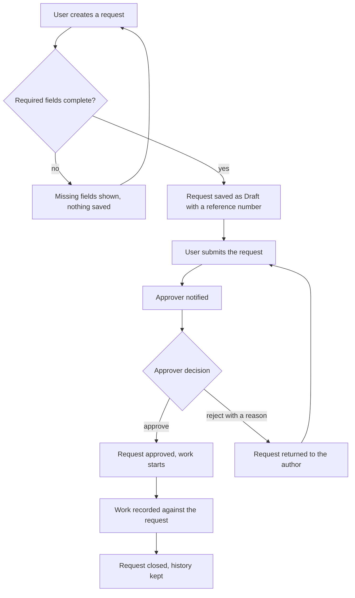
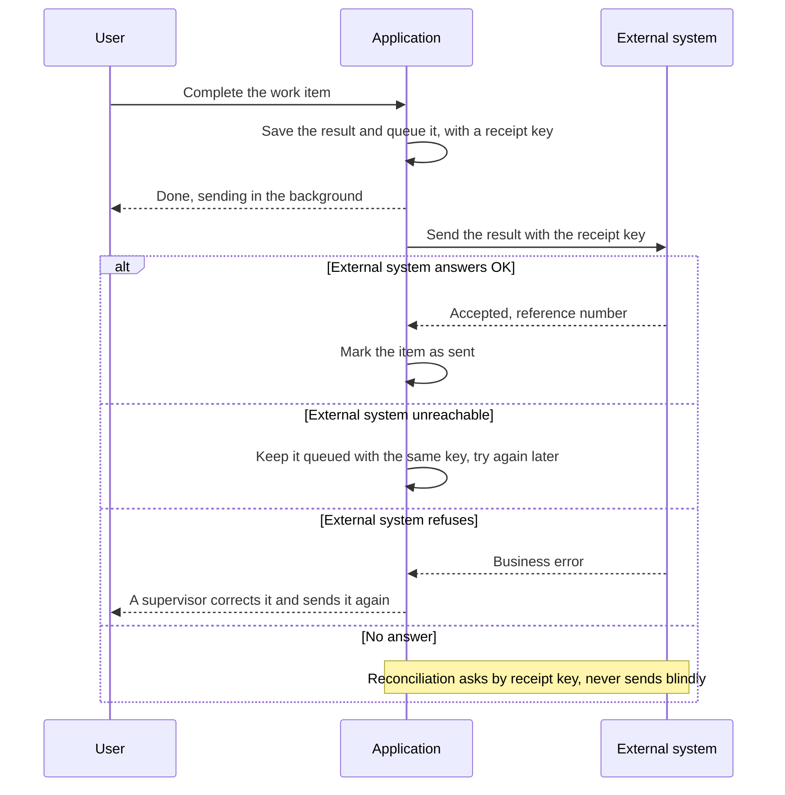

# Process flows (stakeholder view)

Status: 2026-10-09

| | |
|---|---|
| **Audience** | <!-- FILL: who reads this, e.g. business leads, the teams that own the connected systems, IT, QA --> |
| **Source** | derived from [RFC-001](rfc/RFC-001-rosetta.md) and the [requirements](spec/requirements.md); when a flow changes, change the RFC or the spec first and this page in the same branch |
| **Published** | the same diagrams as a shareable page and as `docs/rosetta-flows.pdf` (A4: a cover page and one landscape page per diagram); regenerate both whenever a flow changes <!-- FILL: add the link to the shareable page once it exists, and the date of the last regeneration --> |

<!-- FILL: How to write this page (the PDF builder, scripts/flows_pdf.py, parses it, so the shape is strict).
Each flow is one section with exactly this shape, in this order:
(1) a heading line that starts with two or three hash marks and a space, followed by the flow title;
(2) one blank line;
(3) an opening fence of three backticks immediately followed by the word mermaid, on its own line;
(4) the Mermaid code;
(5) a closing fence of three backticks on its own line;
(6) one blank line;
(7) the caption: one paragraph of one or more consecutive non-blank lines, none starting with a hash mark,
starting with a capital letter, ending with the requirement ids it rests on (for example "Sources RF-001..RF-010.");
(8) a blank line before whatever comes next.
Nothing may sit between the heading and the opening fence (no comment, no text), there is exactly one diagram per
heading, and a FILL comment for a flow goes above its heading, separated by a blank line. Headings without a
diagram directly under them (such as "About this page" or a "Later releases" group heading) are not parsed and
may hold text. The "Status: YYYY-MM-DD" line under the title is the date the flows were last checked against the
spec; pass the same date to the builder (flows_pdf.py with the date option) so the cover and footers show it.
The builder is more lenient than this shape (it also accepts a "Caption:" prefix and heading levels one to
four), but keep the strict shape so any other tool that reads the page keeps working. -->

## About this page

These diagrams show what Rosetta does, in the order it happens, without implementation detail. Each diagram
has a caption that says the one thing a reader must take away and cites the requirement ids behind the steps.

Rules for editing:

- One flow per business process; a flow that no longer fits on one landscape A4 page is split in two.
- Plain words a stakeholder uses; no class names, table names or internal codes in the boxes.
- `flowchart TB` for long chains, because a long left-to-right chain prints too small on A4; left-to-right only
  for short loops of five or six boxes.
- `sequenceDiagram` for interactions between people and systems over time; `stateDiagram-v2` for the life cycle of
  a record.
- Every caption is a sentence starting with a capital letter, under its diagram, citing its RF ids.
- Flows of a later release go under a "Later releases" heading as third-level headings that name the release, for
  example "### Bulk import (Release 2)".
- Update the Status line when the flows are checked against the spec, and regenerate the PDF and the shareable
  page in the same change.

<!-- FILL: Example flow 1 (flowchart). Replace it with the project's main end-to-end process, the one a new
stakeholder should read first. Keep the heading, fence and caption shape. -->

## 1. From request to closed request

Every step is recorded with who did it and when, and a rejected request always carries the approver's reason.
Sources RF-001..RF-010.

<!-- FILL: Example flow 2 (sequence diagram). Replace it with the project's most important interaction with an
external system, or delete it if there is none. The pattern shown (save first, queue, send with a key, reconcile
an unknown outcome) is the one architecture section 8 describes. -->

## 2. Sending a result to an external system exactly once

The user never waits for the external system and never presses a button twice: the receipt key is saved before the
call, so a retry can never create a second record on the other side. Sources RF-100..RF-105.
