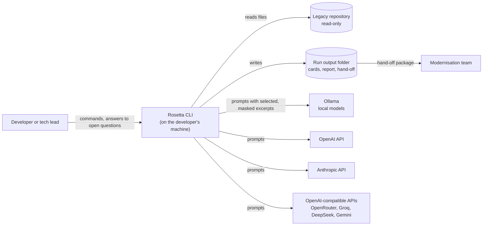
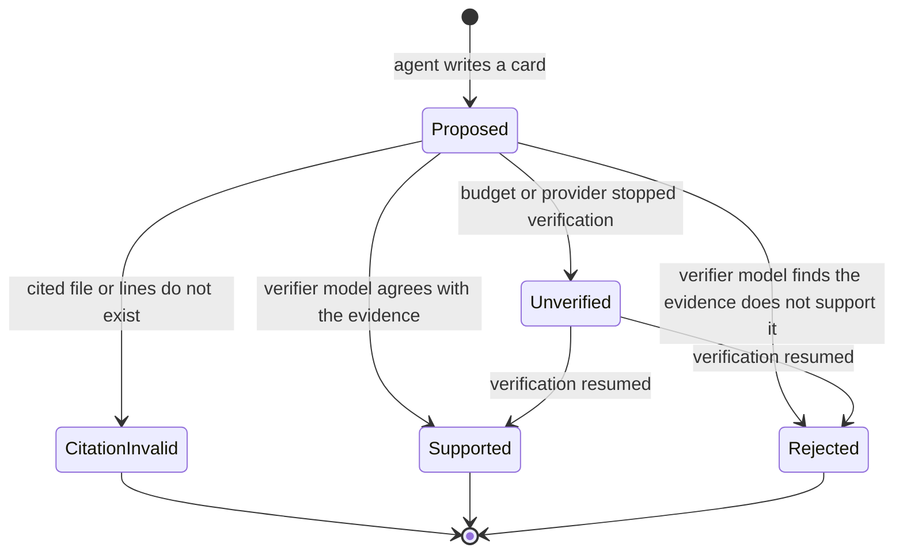
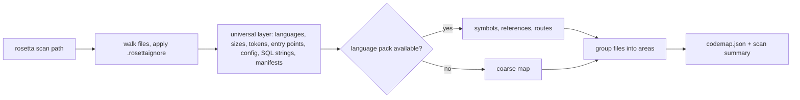
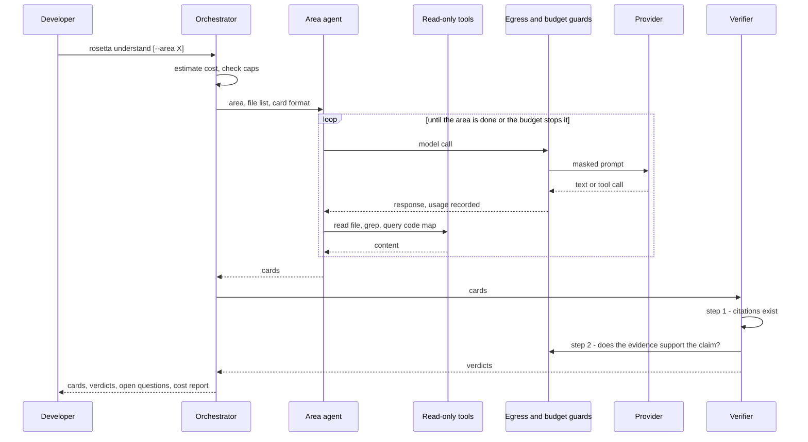

# RFC-001: Rosetta - from a legacy codebase to a verified specification and a modernisation hand-off

| | |
|---|---|
| **Status** | Proposed |
| **Date** | 2026-10-09 |
| **Author** | BlackLigth (blacklight0101) |
| **Reviewers** | BlackLigth (blacklight0101), product owner; master tutors (BIG School) receive the milestone hand-in |
| **Related** | [Requirements](../spec/requirements.md) - [ADRs](../adr/README.md) - [Architecture](../architecture.md) - [Roadmap](../roadmap.md) - [Decision log](../decision-log.md) |

This document proposes the design. It contains no code; contracts are described as field lists and diagrams.
Detailed behaviour lives in the requirements; decisions and their trade-offs live in the ADRs. This RFC links to
them instead of repeating them.

## 1. Context and problem

Most companies run business software written ten to twenty-five years ago: ASP.NET WebForms, classic ASP, VB6,
Java EE, PHP 5, Delphi. Before any of it can be replaced, someone has to find out what it actually does. The
documentation is missing or wrong, the authors have left, and the real business rules hide in page handlers, stored
procedures, configuration flags and SQL strings.

Today that discovery is done by hand: a senior developer reads the code for weeks, writes notes, interviews users
and turns the notes into a specification. It is slow, expensive, depends on one person, and the result rarely says
where each statement comes from, so nobody can check it.

General-purpose AI assistants speed up reading, but used ad hoc they bring new problems:

| Class | Examples | Register |
|---|---|---|
| Unverifiable output | a summary states a rule that is not in the code (hallucination); no file or line to check it against | - |
| Incomplete coverage | the assistant reads what fits in its context and silently skips the rest | - |
| Uncontrolled cost | long agent sessions on paid APIs with no estimate and no cap | - |
| Lock-in and privacy | one vendor's tool; the whole repository, secrets included, is sent to a cloud service | - |
| Not actionable | prose that a team cannot turn into a plan, decisions and tasks | - |

Rosetta is a new tool; it replaces no system (DEC-03). It packages the discovery a senior developer does by hand
into a repeatable pipeline where every statement is evidence-backed, every run has a known cost, and the output is
a hand-off package a team can build from.

## 2. Goals and non-goals

**Goals**

1. Release 1 runs the whole pipeline on one machine: `scan`, `understand` with verification, the open-question
   loop, the HTML report and `plan` (DEC-05; RF-001..RF-699).
2. Every finding cites the file and line range it comes from, and a two-step verifier marks each claim supported or
   rejected, so the specification can be checked by a person in minutes
   ([ADR-005](../adr/ADR-005-evidence-cards-and-two-step-verifier.md); RF-200..RF-399).
3. Works on a legacy codebase in any language, with a richer map where a language pack exists
   ([ADR-004](../adr/ADR-004-universal-scan-and-language-packs.md); RF-100..RF-199).
4. Runs against any AI provider, local or cloud, with a model chosen per role, through one provider interface
   ([ADR-003](../adr/ADR-003-provider-swappable-agent-loop.md); RF-400..RF-419).
5. The cost of a run is estimated before it starts, shown while it runs, capped, and reported afterwards
   ([ADR-007](../adr/ADR-007-cost-control.md); RF-420..RF-429).
6. Only the files a run needs leave the machine, with secrets masked and the analysed repository never modified
   ([ADR-006](../adr/ADR-006-read-only-tools-and-data-egress.md); RF-005, RF-140..RF-149).
7. The final output is a tool-agnostic hand-off package (specification, target architecture, decision records,
   roadmap, task cards) that any team can build from (DEC-10; RF-600..RF-699).
8. Quality is measured, not asserted: a golden set of known findings scores each run, and recorded responses keep
   tests repeatable ([ADR-008](../adr/ADR-008-testing-with-recorded-responses.md); RNF-005, RNF-006).

**Non-goals (explicitly out of release 1)**

- Rebuilding or migrating the legacy system: Rosetta stops at the hand-off package (DEC-10).
- A hosted web service, accounts or a database: Rosetta is a local CLI (DEC-14).
- Modifying, refactoring or running the legacy code: tools are read-only (DEC-17).
- Analysing the owner's employer's code in this public project (DEC-03).
- Training or fine-tuning models.
- Guaranteeing correctness: findings carry a verification status and a confidence, and the open-question loop keeps
  a person in charge.

**Scope decisions (agreed at kick-off)**

Snapshot; canonical entries are DEC-01..DEC-23 in [../decision-log.md](../decision-log.md).

| Question | Chosen | Instead of |
|---|---|---|
| Name and code | **Rosetta** (working name), code `RST` | - |
| Product owner | **BlackLigth (blacklight0101)**, sole owner; master final project | - |
| Replaces a system | **No.** Rosetta analyses third-party legacy codebases | - |
| First milestone (2026-10-26) | **Docs plus a working slice**, public repo, sample report on GitHub Pages, slides, video | Docs plus a compiling skeleton; docs only |
| Repository | **`C:\BuildingFolder\Rosetta`, local git, public GitHub `blacklight0101/Rosetta`** | Local only, GitHub later |
| Document language | **English** | Spanish; mixed |
| Stack | **TypeScript on Node.js** | .NET 10; Python |
| AI access | **Own agent loop behind a provider interface** (Ollama first, then OpenAI, then Anthropic) | Claude Agent SDK (Claude only); Claude Code plugin only |
| Last stage | **A tool-agnostic hand-off package**; no rebuild | An optional rebuild stage |
| Legacy stacks | **Any stack**: universal scan plus language packs | C# / WebForms only |
| Demo target | **Microsoft eShopLegacyWebForms** (MIT) first; a different-stack target later | BlogEngine.NET |
| Cost control | **Estimate, hard caps, live meter, price table, cost report** | Logging only |
| Builders | **Claude agents build, the owner reviews** | The owner codes by hand |

## 3. Alternatives evaluated

| Alternative | Pros | Cons |
|---|---|---|
| **A. Do nothing / keep the current way** (manual reading, ad-hoc chat assistants) | no tool to build; full human judgement | slow, expensive, single-person dependency; unverifiable and incomplete output; no cost control |
| **B. A Claude Code plugin only** (skills and subagents, no standalone app) | little code; runs on an existing subscription | tied to one vendor and one tool; no own cost control; less to learn and to show |
| **C. A standalone app on the Claude Agent SDK** | agent loop, tools and subagents for free | Claude only; the loop is hidden; no swap to local or other providers |
| **D. A standalone CLI with an own agent loop behind a provider interface, plus a plugin run mode later** (chosen) | any provider including free local models; full control of cost, egress and verification; the loop itself is a learning goal | more code to write and test; provider differences must be absorbed by adapters |

Sub-decisions with their own trade-off tables live in the ADRs: ADR-002 (language and form), ADR-003 (agent loop
and providers), ADR-004 (scan layers), ADR-005 (cards and verifier), ADR-006 (read-only tools and data egress),
ADR-007 (cost control), ADR-008 (testing), ADR-009 (Clean Architecture).

## 4. Proposed design

### 4.1 System context

### 4.2 Containers

There is one deployable: the Rosetta CLI, a Node.js process started by the developer. It has no server and no
database. Inside it:

- **Presentation (CLI)** - parses commands and options, loads configuration, wires everything (composition root).
- **Application** - the use cases `scan`, `understand`, `verify`, `answer`, `report`, `plan`, `estimate`, `export`
  and the agent loop; depends only on the domain and its own ports.
- **Domain** - cards, claims, citations, statuses, budgets and their rules.
- **Infrastructure** - LLM providers, the egress guard, the budget guard, the file system, language packs, output
  writers, zip export.

The layers follow Clean Architecture ([ADR-009](../adr/ADR-009-clean-architecture.md)).
- **Run output folder** - everything a run produces, as files (layout in [data-model.md](../data-model.md)).

Detail in [architecture.md](../architecture.md).

### 4.3 Domain model (concept level)

- **Project** - one legacy repository being analysed, with its configuration and its runs.
- **Code map** - the result of `scan`: files, languages, sizes, entry points, symbols and references where a
  language pack exists, and **areas** (groups of files that belong together).
- **Run** - one execution of a stage, with its settings, prompt versions, models, budget and cost report.
- **Agent task** - one agent's job inside a run (for example "describe the Catalog area"), with its own transcript
  and usage.
- **Card** - one finding: a feature (`FEAT`), business rule (`BR`), entity (`ENT`), integration (`INT`) or open
  question (`OQ`). A card holds claims; each **claim** holds one or more **citations** (`path:startLine-endLine`).
- **Verdict** - the verifier's judgement of one claim.
- **Answer** - the developer's answer to an open-question card.
- **Hand-off package** - the output of `plan`.

The run owns its cards; the verifier owns verdicts; only the developer creates answers.

### 4.4 Life cycle of a claim

The canonical state list is in [architecture.md](../architecture.md); this diagram must match it.

Rejected and invalid claims are kept and shown as such; nothing is deleted
([ADR-005](../adr/ADR-005-evidence-cards-and-two-step-verifier.md)).

### 4.5 Key flows

#### 4.5.1 Scan

No AI is used. The scan is deterministic: the same repository gives the same code map. It also gives the inputs to
`estimate`. Covers RF-100..RF-149.

#### 4.5.2 Understand and verify

Failure paths: when a provider is down or rate-limited, the call is retried with back-off and then the agent task
stops with its partial cards saved; when a budget cap is reached, the run stops cleanly and records which tasks did
not finish (`Unverified`); a run can be resumed. Covers RF-200..RF-399, RF-420..RF-429.

#### 4.5.3 Open questions, report and plan

The developer answers `OQ` cards in a Markdown answers file or interactively; `understand` can be re-run for the
affected areas with the answers as context. `report` renders the cards, verdicts, code map and cost into a static
HTML site. `plan` reads the verified cards and answers and writes the hand-off package. Covers RF-240..RF-249,
RF-500..RF-699.

### 4.6 Identity, authorization and audit

There are no users or accounts: the developer running the CLI is the only actor (DEC-14). Provider credentials come
from environment variables or a git-ignored `.env` file and are never written to output. Audit is the run record:
every run folder keeps its settings, prompt versions, model ids, the files sent to each provider and the usage, so
a result can be explained and repeated (RNF-004).

### 4.7 Deployment topology

Rosetta runs on the developer's machine. Release 1 runs from source (`npm` scripts) with Node.js LTS; publishing to
the npm registry is open (Q-08). Local models run in Ollama on the same machine. The sample report for the demo
target is published as a static site on GitHub Pages and serves as the milestone's deployment URL (DEC-04). Detail
in [environments-and-delivery.md](../environments-and-delivery.md).

### 4.8 Cost control

Before a run, `estimate` turns the code map and the planned agent tasks into a token and cost forecast per role
from the price table. During a run, the budget guard meters every call and stops the run when a cap is reached.
After a run, the cost report lists tokens and cost by role, agent, provider and model. Local models count as zero
cost but their tokens are still tracked, so runs on different providers can be compared
([ADR-007](../adr/ADR-007-cost-control.md)).

### 4.9 Claude Code plugin run mode

After release 1's core, the same prompts and card formats are packaged as a Claude Code plugin (skills and
subagents) so a final run can use a Claude subscription instead of API credit. The plugin reads the same code map
and writes the same output folder; the verifier's step 1 runs as a script. Covers RF-700..RF-799.

## 5. Impact

**Risks**

| Risk | Mitigation |
|---|---|
| Local 7-9B models follow tool-calling and card formats poorly (Q-04) | spike card in P1 picks the model; strict JSON schemas with validation and one repair retry; the verifier and final runs can use a stronger cloud model |
| Hallucinated rules reach the specification | two-step verifier; rejected claims stay visible; golden set measures precision (RNF-006) |
| A run silently skips files | coverage table in every run: files read per area against files in the area (RF-230) |
| Cost overrun on paid APIs | estimate, hard caps per run and per role, prepaid accounts with spending limits (ADR-007) |
| Secrets or private code sent to a cloud provider | `.rosettaignore`, secret masking, cloud warning, record of every file sent (ADR-006) |
| The demo app is small and has few business rules | second, richer target in a different stack after the milestone (Q-05) |
| Seventeen days to the milestone | the milestone slice is cut to one area, Ollama and OpenAI only, Markdown output; everything else is later phases |
| Provider APIs differ (tool-call formats, caching, usage fields) | adapters normalise to one port; a contract test runs against every adapter with recorded responses |

**Costs**: no infrastructure. Development runs on local models at zero API cost; the OpenAI credit (10 EUR) and a
capped Anthropic account cover verification and final runs, estimated at 60-100 USD over the whole project. Claude
agent sessions build the code (DEC-22).

**Migrations**: none; Rosetta is new.

**Rollback**: not applicable to users; a bad release is reverted by checking out the previous tag.

## 6. Implementation plan

Phases P0..Pn with exit criteria are maintained in [roadmap.md](../roadmap.md). Summary:

| Phase | Delivers |
|---|---|
| P0 | this documentation set, decisions, open questions |
| P1 | milestone slice (2026-10-26): CLI, config, providers Ollama and OpenAI, budget guard, universal scan and C# pack, `understand` on one area, Markdown cards, sample report on GitHub Pages, slides, video |
| P2 | full `understand`: all areas, two-step verifier, open-question loop, golden-set evaluation, `estimate`, Anthropic and OpenAI-compatible adapters |
| P3 | `report` (HTML) and `plan` (hand-off package) |
| P4 (R2) | Claude Code plugin mode, second demo target in another stack, provider comparison, final master delivery |

## 7. Success criteria

| Metric | Target | How measured |
|---|---|---|
| Claim precision on the demo app | at least 90% of `Supported` claims are correct | golden set, hand-checked (RNF-006) |
| Recall of known business rules | at least 70% of golden-set rules found | golden set (RNF-006) |
| Citation validity | 100% of citations in `Supported` claims point to existing lines | verifier step 1 report |
| Coverage | every file of an analysed area read at least once, or listed as skipped with a reason | run coverage table (RF-230) |
| Cost of a full demo run | under 1 USD with the cheapest cloud model; 0 USD with Ollama | cost report (RF-426) |
| Estimate accuracy | actual cost within 30% of the estimate | estimate versus cost report |
| Scan time | under 10 seconds for the demo app | timing in the scan summary |
| Repeatable tests | the full test suite passes with no network | CI run with network disabled (RNF-005) |

## 8. Open questions

Maintained in one place: [requirements.md section 4](../spec/requirements.md#4-open-questions). Each question has an
owner, the phase that needs the answer and a default that applies until it is answered.
