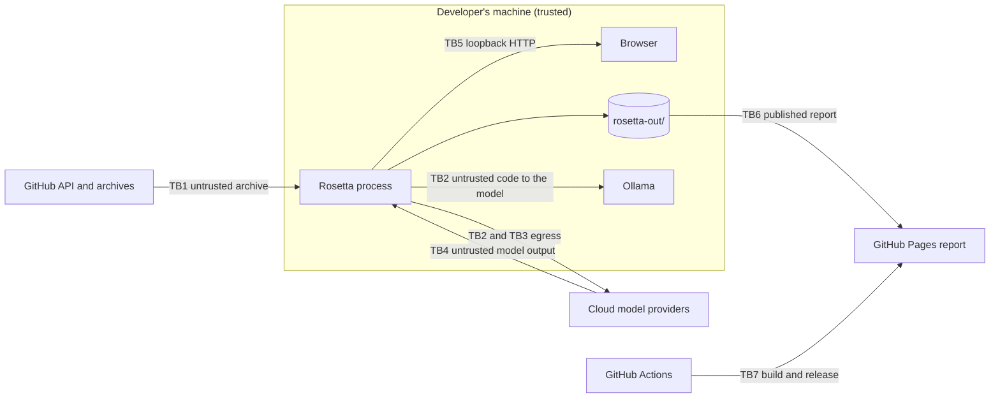

# Threat model

| | |
|---|---|
| **Status** | Proposed (2026-10-11) |
| **Owner** | BlackLigth (blacklight0101) |
| **Decisions** | [ADR-013](../adr/ADR-013-untrusted-code-and-model-output.md), [ADR-006](../adr/ADR-006-read-only-tools-and-data-egress.md), [ADR-012](../adr/ADR-012-local-web-ui-and-github-sources.md), DEC-57, DEC-58 |
| **Reviewed** | at every phase exit and whenever a trust boundary changes (a new input, output, provider or server route) |

The four questions of threat modelling: what are we building, what can go wrong, what are we doing about it, and did
we do a good job. The last one is answered by the tests named in each requirement and by the review dates above.

## 1. What we are building

A command-line tool with a loopback web page that downloads a public GitHub repository at one commit, maps it, lets
language-model agents read it through read-only tools, verifies their claims, and publishes a static report. One
user, no accounts, no database, no hosted server ([architecture](../architecture.md)).

## 2. Trust boundaries and threats (STRIDE)

| Boundary | Threat (STRIDE) | Control | Requirement |
|---|---|---|---|
| TB1 GitHub download | Tampering: hostile archive writes outside the snapshot (path traversal, symbolic or hard link) | entry paths normalised; links refused; extraction in a temporary folder renamed when complete | RF-122, RF-127 |
| TB1 | Denial of service: huge archive or millions of entries | size and entry-count limits | RF-127 |
| TB1 | Spoofing / SSRF: a URL or redirect leads somewhere other than GitHub | https only; host allowlist on every redirect; only `github.com` repository URLs parsed | RF-120, RF-127 |
| TB2 code to the model | Elevation of privilege: indirect prompt injection in the analysed code steers the agents | tool results in delimited data blocks, never in the system prompt; prompts declare them data; read-only tools; citation check in code; caps | RF-145, RF-201, RF-300, RF-422 |
| TB2 | Denial of service: model-chosen regular expression blocks the process | pattern and line limits; grep in a worker with a timeout | RF-146 |
| TB3 egress | Information disclosure: secrets or ignored files sent to a provider | built-in deny list, `.rosettaignore`, masking that fails closed, egress log, cloud warning | RF-140, RF-141, RF-142, RF-143, RF-147 |
| TB4 model output | Tampering: output written as code, commands or paths | output parsed with schemas; never executed; never used as a path or command | RF-202, architecture section 10 |
| TB4 | Tampering: output rendered as HTML (stored XSS in the page or the report) | text-only rendering; no raw HTML; only `https://github.com/` links | RF-507 |
| TB5 loopback web | Spoofing: another site or machine drives Rosetta (CSRF, DNS rebinding) | loopback bind; session token; `Host` and `Origin` checks | RF-1009 |
| TB5 | Information disclosure: the token leaks through the Referer header or history | `Referrer-Policy: no-referrer`; token moved out of the address bar; content security policy | RF-1013 |
| TB5, TB6 | Repudiation and blind spots: refused requests and reads leave no trace | security events logged as `warn` and counted in the page | RF-009, RF-1011 |
| TB6 published report | Information disclosure: secrets or employer material published | masked transcripts; output scan in CI; DEC-03 | RNF-003, DEC-03 |
| TB7 CI and release | Tampering: compromised dependency or action | lockfile and `npm ci`; actions pinned to a commit SHA; dependency review; CodeQL; gitleaks; SBOM on releases | environments-and-delivery.md sections 6 and 8 |
| TB7 | Elevation of privilege: shell injection through a pull request title | titles passed through `env:`, never `${{ }}` inside `run:` | environments-and-delivery.md section 6 |

## 3. OWASP Top 10:2025 mapping

| Risk | Status | How |
|---|---|---|
| A01 Broken access control | covered | loopback, session token, `Host`/`Origin` checks (RF-1009); single user |
| A02 Security misconfiguration | covered | secure defaults (RNF-014); security headers (RF-1013) |
| A03 Software supply chain failures | covered | lockfile, pinned actions, Dependabot, dependency review, `npm audit`, SBOM (environments section 6, 8) |
| A04 Cryptographic failures | not applicable | Rosetta stores no secrets and transmits only over the providers' and GitHub's HTTPS |
| A05 Injection | covered | output never executed or rendered as HTML (RF-507); no shell; no database |
| A06 Insecure design | covered | this threat model; ADR-013 |
| A07 Authentication failures | partial by design | no accounts; the per-session token is the only credential (RF-1009, RF-1013) |
| A08 Software or data integrity failures | covered | commit-pinned snapshots with a hash (RF-121, RF-126); schema-validated files (data-model.md) |
| A09 Logging and alerting failures | covered | security events in the application log (RF-009) |
| A10 Mishandling of exceptional conditions | covered | guards fail closed (RF-141); typed errors with codes (conventions section 6) |

Server-side request forgery is handled at TB1 (RF-127) and for the OpenAI-compatible `baseUrl` (RF-403).

## 4. OWASP Top 10 for LLM applications (2025) mapping

| Risk | Status | How |
|---|---|---|
| LLM01 Prompt injection | covered | RF-145; bounded impact through read-only tools and the citation check |
| LLM02 Sensitive information disclosure | covered | masking, deny list, ignore file, egress log (RF-140..RF-147) |
| LLM03 Supply chain | covered | model and prompt versions pinned and recorded (RNF-004) |
| LLM04 Data and model poisoning | not applicable | Rosetta trains nothing |
| LLM05 Improper output handling | covered | RF-202, RF-507 |
| LLM06 Excessive agency | covered | read-only tools only; no write, network or shell tool (RF-201, RF-005) |
| LLM07 System prompt leakage | accepted | prompts are public in the repository; they hold no secrets |
| LLM08 Vector and embedding weaknesses | not applicable | no vector store (DEC-58) |
| LLM09 Misinformation | covered | evidence-cited claims and the two-step verifier (ADR-005) |
| LLM10 Unbounded consumption | covered | caps per run and role, estimate, live meter (RF-420..RF-428) |

## 5. Secure development lifecycle

| NIST SSDF group | Rosetta practice |
|---|---|
| PO Prepare the organisation | CLAUDE.md hard rules; conventions; ADRs; this threat model |
| PS Protect the software | branch ruleset, owner-only merges, secret scanning with push protection, pinned actions |
| PW Produce well-secured software | requirements first (ADR-010), abuse-case tests per security requirement, lint rules, CodeQL, verifier security checks |
| RV Respond to vulnerabilities | `SECURITY.md`, private vulnerability reporting, Dependabot alerts and security updates |

Tools considered and not adopted: Snyk Code (uploads source to a third party and adds nothing over CodeQL, `npm
audit` and Dependabot), DAST scanners (no deployed server), container scanners (no image) - DEC-58.

## 6. Residual risks

- A prompt injection may still bias the wording of a card that cites real lines; the verifier's model step can be
  fooled the same way. The report always shows the cited lines, so a reader can check.
- A local process running as the same user can read `rosetta-out/`; Rosetta does not defend against a compromised
  machine.
