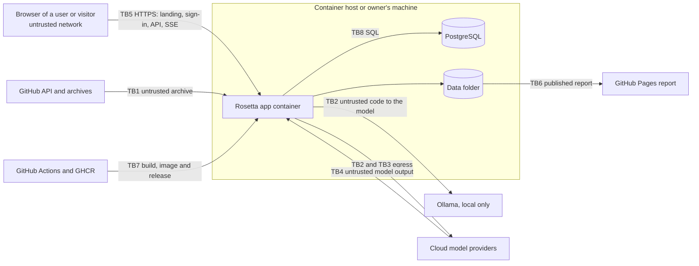

# Threat model

| | |
|---|---|
| **Status** | Proposed (2026-10-11; rewritten the same day for the hosted application, DEC-69) |
| **Owner** | BlackLigth (blacklight0101) |
| **Decisions** | [ADR-013](../adr/ADR-013-untrusted-code-and-model-output.md), [ADR-006](../adr/ADR-006-read-only-tools-and-data-egress.md), [ADR-012](../adr/ADR-012-local-web-ui-and-github-sources.md), [ADR-014](../adr/ADR-014-container-image-local-and-hosted.md), [ADR-015](../adr/ADR-015-accounts-sessions-and-user-secrets.md), [ADR-016](../adr/ADR-016-postgresql-and-files.md), [ADR-017](../adr/ADR-017-fastify-http-server.md), DEC-57, DEC-58, DEC-69 |
| **Reviewed** | at every phase exit and whenever a trust boundary changes (a new input, output, provider or server route) |

The four questions of threat modelling: what are we building, what can go wrong, what are we doing about it, and did
we do a good job. The last one is answered by the tests named in each requirement and by the review dates above.

## 1. What we are building

A web application, reachable over the internet when hosted, behind which invited users sign in, download a public
GitHub repository at one commit, map it, let language-model agents read it through read-only tools, verify their
claims, and publish a static report. It stores accounts, sessions, encrypted provider keys and a cost ledger in
PostgreSQL, and snapshots and run output on a disk. Paid model calls run with the owner's server keys under caps
([architecture](../architecture.md)).

## 2. Trust boundaries and threats (STRIDE)

| Boundary | Threat (STRIDE) | Control | Requirement |
|---|---|---|---|
| TB1 GitHub download | Tampering: hostile archive writes outside the snapshot (path traversal, symbolic or hard link) | entry paths normalised; links refused; extraction in a temporary folder renamed when complete | RF-122, RF-127 |
| TB1 | Denial of service: huge archive or millions of entries | size and entry-count limits | RF-127 |
| TB1 | Spoofing / SSRF: a URL or redirect leads somewhere other than GitHub | https only; host allowlist on every redirect; only `github.com` repository URLs parsed | RF-120, RF-127 |
| TB2 code to the model | Elevation of privilege: indirect prompt injection in the analysed code steers the agents | tool results in delimited data blocks, never in the system prompt; prompts declare them data; read-only tools; citation check in code; caps | RF-145, RF-201, RF-300, RF-422 |
| TB2 | Denial of service: model-chosen regular expression blocks the process | pattern and line limits; grep in a worker with a timeout | RF-146 |
| TB3 egress | Information disclosure: secrets or ignored files sent to a provider | built-in deny list, `.rosettaignore`, masking that fails closed, egress log, cloud warning | RF-140, RF-141, RF-142, RF-143, RF-147 |
| TB4 model output | Tampering: output written as code, commands or paths | output parsed with schemas; never executed; never used as a path or command | RF-202, architecture section 10 |
| TB4 | Tampering: output rendered as HTML (stored XSS in the page or the report) | text-only rendering; no raw HTML; only `https://github.com/` links | RF-507 |
| TB5 web | Spoofing: password guessing or credential stuffing | scrypt hashes; 12-character minimum and common-password check; lockout after 5 failures; rate limit per IP; same message and timing for unknown users | RF-1100, RF-1103 |
| TB5 | Spoofing: session theft or fixation | random 256-bit id rotated at sign-in; only its hash stored; `__Host-` cookie with `HttpOnly`, `Secure`, `SameSite=Strict`; idle and absolute expiry; HSTS | RF-1101, RF-1013 |
| TB5 | Spoofing: another site drives a signed-in browser (CSRF) | `SameSite=Strict`; CSRF token and `Origin` check on every state-changing request | RF-1009 |
| TB5 | Information disclosure: one user reads another's projects, runs, files or keys (IDOR) | every query and path scoped by the actor; 404 for foreign ids; access matrix test with two users | RF-1105 |
| TB5 | Elevation of privilege: a user calls an administrator route | role checked on the server for every route; a `user` gets 403 and the attempt is audited | RF-1102, RF-1109 |
| TB5 | Denial of service and cost abuse: a user spends the owner's server keys | caps per run, user-day and server-month checked before every call; run queue; one running run per user; admin banner at 80% | RF-1106, RF-1108 |
| TB5 | Information disclosure: secrets in responses, errors or logs | no key returned after saving; no stack trace in any response; masked logs; output scan test | RF-007, RF-1104, RNF-003 |
| TB5 | Information disclosure: the landing page is indexed | `noindex`; `robots.txt` disallows all | RF-1201 |
| TB5, TB6 | Repudiation and blind spots: refused requests and reads leave no trace | security events logged as `warn` and counted in the page; account and key events in the audit table | RF-009, RF-1011, RF-1109 |
| TB8 database | Tampering: SQL injection | parameterised queries only, enforced by a lint rule; the app role cannot change the schema | ADR-016 |
| TB8 | Information disclosure: a database dump exposes keys or passwords | keys encrypted with AES-256-GCM under `ROSETTA_SECRET_KEY` held outside the database; passwords and session ids hashed | RF-1104, ADR-015 |
| TB8 | Repudiation: the audit trail is altered | the app role may only insert into `audit_events` and `cost_ledger` | data-model.md section 6 |
| TB6 published report | Information disclosure: secrets or employer material published | masked transcripts; output scan in CI; DEC-03 | RNF-003, DEC-03 |
| TB7 CI and release | Tampering: compromised dependency or action | lockfile and `npm ci`; actions pinned to a commit SHA; dependency review; CodeQL; gitleaks; SBOM on releases | environments-and-delivery.md sections 6 and 8 |
| TB7 | Tampering: a vulnerable or altered container image | base image pinned by digest; non-root user; image scanned in CI; images tagged by version and commit in GHCR; secrets never baked in | RF-1300, environments-and-delivery.md |
| TB7 | Elevation of privilege: shell injection through a pull request title | titles passed through `env:`, never `${{ }}` inside `run:` | environments-and-delivery.md section 6 |

## 3. OWASP Top 10:2025 mapping

| Risk | Status | How |
|---|---|---|
| A01 Broken access control | covered | sign-in on every route but the public ones; roles checked on the server; per-user scoping; CSRF and `Origin` checks (RF-1009, RF-1102, RF-1105) |
| A02 Security misconfiguration | covered | secure defaults (RNF-014); security headers and HSTS (RF-1013); configuration validated at start (RF-1305); local port on `127.0.0.1` |
| A03 Software supply chain failures | covered | lockfile, pinned actions and base image, Dependabot, dependency review, `npm audit`, image scan, SBOM (environments section 6, 8) |
| A04 Cryptographic failures | covered | scrypt for passwords, SHA-256 for session ids, AES-256-GCM for keys, HTTPS with HSTS when hosted (ADR-015) |
| A05 Injection | covered | parameterised SQL (ADR-016); output never executed or rendered as HTML (RF-507); no shell |
| A06 Insecure design | covered | this threat model; ADR-013; caps against cost abuse (RF-1106) |
| A07 Authentication failures | covered | lockout, rate limits, password rules, session rotation and expiry, no self sign-up (RF-1100..RF-1103) |
| A08 Software or data integrity failures | covered | commit-pinned snapshots with a hash (RF-121, RF-126); schema-validated files and settings; migration checksums (RF-1302) |
| A09 Logging and alerting failures | covered | security events in the application log (RF-009); audit trail (RF-1109); cap banner (RF-1106) |
| A10 Mishandling of exceptional conditions | covered | guards fail closed (RF-141); typed errors with codes, no stack traces in responses (RF-007) |

Server-side request forgery is handled at TB1 (RF-127) and for the OpenAI-compatible `baseUrl` (RF-403); a user's
`openai-compatible` base URL must be `https` and must not resolve to a private, loopback or link-local address
(RF-1104).

## 4. OWASP Top 10 for LLM applications (2025) mapping

| Risk | Status | How |
|---|---|---|
| LLM01 Prompt injection | covered | RF-145; bounded impact through read-only tools and the citation check |
| LLM02 Sensitive information disclosure | covered | masking, deny list, ignore file, egress log (RF-140..RF-147) |
| LLM03 Supply chain | covered | model and prompt versions pinned and recorded (RNF-004) |
| LLM04 Data and model poisoning | not applicable | Rosetta trains nothing |
| LLM05 Improper output handling | covered | RF-202, RF-507 |
| LLM06 Excessive agency | covered | read-only tools only; no write, network or shell tool (RF-201, RF-005) |
| LLM07 System prompt leakage | accepted | prompts are public in the repository; they hold no secrets |
| LLM08 Vector and embedding weaknesses | not applicable | no vector store (DEC-58) |
| LLM09 Misinformation | covered | evidence-cited claims and the two-step verifier (ADR-005) |
| LLM10 Unbounded consumption | covered | caps per run and role, estimate, live meter (RF-420..RF-428) |

## 5. Secure development lifecycle

| NIST SSDF group | Rosetta practice |
|---|---|
| PO Prepare the organisation | CLAUDE.md hard rules; conventions; ADRs; this threat model |
| PS Protect the software | branch ruleset, owner-only merges, secret scanning with push protection, pinned actions |
| PW Produce well-secured software | requirements first (ADR-010), abuse-case tests per security requirement, lint rules, CodeQL, verifier security checks |
| RV Respond to vulnerabilities | `SECURITY.md`, private vulnerability reporting, Dependabot alerts and security updates |

Tools considered and not adopted: Snyk Code (uploads source to a third party and adds nothing over CodeQL, `npm
audit` and Dependabot) - DEC-58. Since DEC-69 the image is scanned in CI, and a baseline DAST scan (OWASP ZAP
baseline against the local Compose stack) runs before the hosted deployment.

## 6. Residual risks

- A prompt injection may still bias the wording of a card that cites real lines; the verifier's model step can be
  fooled the same way. The report always shows the cited lines, so a reader can check.
- No multi-factor sign-in and no e-mail reset in release 1 (ADR-015); accounts are few and created by hand, and the
  teacher password is delivered only in the hand-in form.
- Losing `ROSETTA_SECRET_KEY` makes stored user keys unreadable; leaking it together with a database dump exposes
  them. It lives only in the host's secret store and the owner's git-ignored `.env`.
- The host provider and its staff are trusted with the database and the disk.
- A process on the owner's machine can read the local volumes; Rosetta does not defend against a compromised machine.
